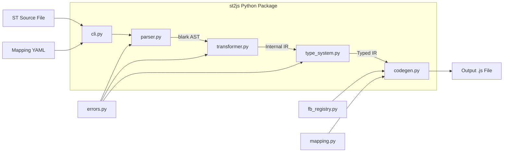
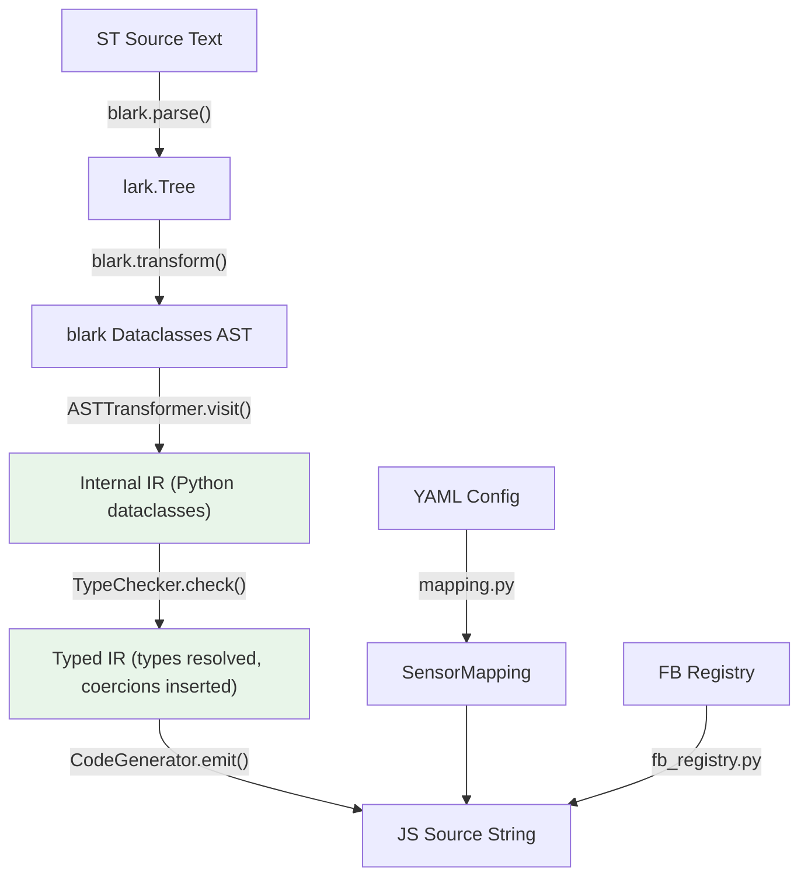

# ST-to-JS Converter (st2js) Design Document

## Overview

The `st2js` tool converts IEC 61131-3 Structured Text (ST) programs into JavaScript compatible with the UniSet2 JScript extension. It parses ST source using the blark library, transforms the AST into an internal IR, applies sensor mapping from a YAML configuration, and emits a single `.js` file that integrates with the `uniset_on_step()` cyclic execution model and the `uniset2-iec61131.js` function block library.

## Design Summary (Meta)

```yaml
design_type: "new_feature"
risk_level: "medium"
complexity_level: "medium"
complexity_rationale: >
  (1) Full IEC 61131-3 type system (BOOL/INT/DINT/REAL/TIME/STRING/STRUCT/ARRAY),
  PROGRAM + FUNCTION_BLOCK declarations with instantiation, and 10 standard FB
  mappings require careful AST traversal with type awareness.
  (2) blark's Beckhoff-oriented grammar needs validation against pure IEC 61131-3
  constructs; REAL-to-integer scale factors add cross-cutting type coercion logic.
main_constraints:
  - "Generated JS must run in QuickJS (ES2020 subset, no Node.js APIs)"
  - "Must use load() instead of import/require for uniset2-iec61131.js"
  - "UniSet sensors are integer-only; REAL values need scale factor conversion"
  - "Pure IEC 61131-3 dialect only -- no Beckhoff/Codesys extensions"
biggest_risks:
  - "blark grammar may reject valid pure IEC 61131-3 or accept Beckhoff-only constructs silently"
  - "Complex nested STRUCT/ARRAY sensor flattening may produce hard-to-debug mapping errors"
unknowns:
  - "Exact blark AST node types for PROGRAM vs FUNCTION_BLOCK declarations"
  - "Whether blark handles TIME literals (T#5s) in pure IEC 61131-3 form"
```

## Background and Context

### Prerequisite ADRs

- [ADR-0001-st2js-python-blark.md](../adr/ADR-0001-st2js-python-blark.md): Decision to use Python + blark for ST parsing

### Agreement Checklist

#### Scope
- [x] New Python package at `extensions/JScript/tools/st2js/`
- [x] CLI entry point: `python -m st2js input.st -m mapping.yaml -o output.js`
- [x] Full ST v1 language support: VAR sections, control flow, data types, STRUCT, ARRAY
- [x] PROGRAM and FUNCTION_BLOCK declarations with instantiation
- [x] Standard FB mapping to uniset2-iec61131.js classes (TON, TOF, TP, CTU, CTD, CTUD, RS, SR, R_TRIG, F_TRIG)
- [x] YAML-based sensor mapping with REAL scale factors
- [x] STRUCT sensor mapping: top-level (default) and flatten modes

#### Non-Scope (Explicitly not changing)
- [x] UniSet2 C++ code -- no modifications to JSEngine, JSProxy, or any C++ files
- [x] `uniset2-iec61131.js` -- consumed as-is, no modifications
- [x] Autotools build system -- st2js is a standalone Python package
- [x] Beckhoff/Codesys-specific ST extensions (REFERENCE, POINTER, FB_init, pragmas)
- [x] Runtime execution -- tool is offline/build-time only

#### Constraints
- [x] Parallel operation: N/A -- offline build tool
- [x] Backward compatibility: N/A -- new tool, no existing users
- [x] Performance measurement: Not required -- batch conversion of small files

#### Applicable Standards
- [x] UniSet JScript `uniset_inputs`/`uniset_outputs` array format `[explicit]` - Source: `extensions/JScript/JSEngine.cc`, `extensions/JScript/main.js`
- [x] `load()` function for JS module inclusion `[explicit]` - Source: `extensions/JScript/main.js:1-4`
- [x] `in_` / `out_` variable prefix convention for sensors `[explicit]` - Source: `extensions/JScript/main.js:50-51` (`in_JS_AI1_AS`, `out_JS_AO1_C`)
- [x] QuickJS ES2020 subset (no async/await, no import/export at runtime) `[explicit]` - Source: QuickJS engine limitations
- [x] Python package structure with `pyproject.toml` `[implicit]` - Evidence: modern Python packaging standards -- Confirmed: Yes
- [x] 4-space indentation for Python `[implicit]` - Evidence: PEP 8 standard -- Confirmed: Yes

### Problem to Solve

PLC engineers write control logic in IEC 61131-3 Structured Text. Currently, to deploy such logic on UniSet2 JScript runtime, they must manually rewrite ST programs in JavaScript. This is error-prone, time-consuming, and creates a maintenance burden when ST sources change.

### Current Challenges

1. No automated path from ST source to UniSet-compatible JS
2. Manual translation loses semantic fidelity (type coercion, FB call conventions)
3. PLC engineers unfamiliar with JavaScript must learn the UniSet JS API
4. REAL-valued sensor data requires manual scale factor arithmetic

### Requirements

#### Functional Requirements

- FR1: Parse valid IEC 61131-3 ST source files (PROGRAM and FUNCTION_BLOCK declarations)
- FR2: Convert ST control flow (IF/ELSIF/ELSE, CASE..OF, FOR, WHILE, REPEAT) to JS equivalents
- FR3: Convert ST expressions (arithmetic, boolean, comparison, assignment) to JS
- FR4: Map IEC data types (BOOL, INT, DINT, REAL, TIME, STRING) with type awareness
- FR5: Support STRUCT and ARRAY declarations and access
- FR6: Map standard FB instantiation and calls to uniset2-iec61131.js class usage
- FR7: Load sensor mapping from YAML config and generate uniset_inputs/uniset_outputs arrays
- FR8: Apply REAL scale factors (divide on input, multiply on output)
- FR9: Generate a single self-contained .js file with load(), sensor arrays, variables, and uniset_on_step()
- FR10: Report errors with ST source file line/column references

#### Non-Functional Requirements

- **Performance**: Convert a 500-line ST file in under 2 seconds
- **Reliability**: Reject unsupported constructs with clear error messages rather than generating incorrect JS
- **Maintainability**: Each pipeline stage (parse, transform, type-check, codegen) independently testable

## Acceptance Criteria (AC) - EARS Format

### FR1-FR3: Parsing and Control Flow

- [ ] **When** a valid ST file with PROGRAM declaration is provided, the system shall parse it and produce JS with a `uniset_on_step()` function containing the translated body
- [ ] **When** a FUNCTION_BLOCK declaration is provided, the system shall generate a JS class with constructor (for VAR) and an `execute()` method (for body)
- [ ] **When** IF/ELSIF/ELSE/END_IF is present, the system shall emit equivalent `if/else if/else` JS
- [ ] **When** CASE..OF is present, the system shall emit a `switch/case` with `break` statements
- [ ] **When** FOR loop is present, the system shall emit a `for` loop with correct bounds and step
- [ ] **When** WHILE loop is present, the system shall emit a `while` loop
- [ ] **When** REPEAT..UNTIL loop is present, the system shall emit a `do { } while(!condition)` loop
- [ ] **If** the ST file contains syntax errors, **then** the system shall report the error with line/column number and exit with non-zero status

### FR4-FR5: Type System

- [ ] **When** a BOOL variable is used in an arithmetic context, the system shall emit a coercion (`(x ? 1 : 0)`)
- [ ] **When** an INT or DINT variable is assigned a REAL expression, the system shall emit `Math.trunc()`
- [ ] **When** a TIME literal (e.g. `T#3s`, `T#500ms`) is encountered, the system shall convert to milliseconds integer
- [ ] **When** a STRUCT type is declared and instantiated, the system shall emit a JS object literal with matching fields
- [ ] **When** ARRAY is declared, the system shall emit a JS Array with correct length initialization
- [ ] **When** STRUCT fields are accessed (e.g. `myStruct.field`), the system shall emit equivalent JS property access

### FR6: Function Block Mapping

- [ ] **When** a standard FB (TON, TOF, TP, CTU, CTD, CTUD, RS, SR, R_TRIG, F_TRIG) is instantiated in VAR, the system shall emit `const name = new FBType(args)` with correct constructor arguments
- [ ] **When** a standard FB is called (e.g. `ton1(IN := condition, PT := T#3s)`), the system shall emit `ton1.update(condition)` with arguments in the correct positional order per uniset2-iec61131.js API
- [ ] **When** a FB output is read (e.g. `ton1.Q`, `ctu1.CV`), the system shall emit equivalent JS property access
- [ ] **If** an unknown FB type is used, **then** the system shall report an error listing available FB types

### FR7-FR8: Sensor Mapping and Scale Factors

- [ ] **When** a YAML mapping file is provided, the system shall generate `uniset_inputs` and `uniset_outputs` arrays with sensor names
- [ ] **When** a VAR_INPUT variable has a mapping entry, the system shall read it as `in_<SensorName>` in the generated JS
- [ ] **When** a VAR_OUTPUT variable has a mapping entry, the system shall write it as `out_<SensorName>` in the generated JS
- [ ] **When** a REAL input has `scale: N` in mapping, the system shall generate `varName = in_SensorName / N`
- [ ] **When** a REAL output has `scale: N` in mapping, the system shall generate `out_SensorName = Math.round(varName * N)`
- [ ] **If** a VAR_INPUT/VAR_OUTPUT variable has no mapping entry, **then** the system shall report an error

### FR9: Output Format

- [ ] The generated JS file shall begin with `load("uniset2-iec61131.js")`
- [ ] The generated JS file shall contain `uniset_inputs` array before `uniset_outputs` array
- [ ] Local variables (VAR section) shall be declared before `uniset_on_step()`
- [ ] The `uniset_on_step()` function shall contain the translated PROGRAM body

### FR10: Error Reporting

- [ ] **When** an unsupported ST construct is encountered, the system shall report the construct name, file, line, and column
- [ ] **When** the YAML mapping references a variable not in the ST file, the system shall emit a warning
- [ ] **When** a type mismatch is detected (e.g. assigning STRING to INT), the system shall report a type error

## Existing Codebase Analysis

### Implementation Path Mapping

| Type | Path | Description |
|------|------|-------------|
| Existing | `extensions/JScript/js/uniset2-iec61131.js` | Target FB library (consumed, not modified) |
| Existing | `extensions/JScript/IEC61131.md` | FB documentation with API signatures |
| Existing | `extensions/JScript/main.js` | Reference JS showing uniset_inputs/outputs/on_step pattern |
| Existing | `extensions/JScript/js/main.template.js` | Minimal JS template showing expected structure |
| Existing | `extensions/JScript/JSEngine.h` | C++ engine showing sensor binding (inputs/outputs maps) |
| New | `extensions/JScript/tools/st2js/` | New Python package (all new files) |

### Similar Functionality Search

- **Utilities/codegen/**: XSLT-based code generator for C++ from XML configs. Different domain (XML->C++), different technology (XSLT). Not reusable. Decision: **new implementation**.
- **wrappers/python/**: Python bindings for UniSet2 runtime API. No code generation functionality. Decision: **no overlap**.
- **extensions/LogicProcessor/**: C++ logic element processor. Processes logic schemas from XML, not ST source. Different execution model. Decision: **no overlap**.

### Code Inspection Evidence

| File/Function | Relevance |
|---------------|-----------|
| `extensions/JScript/js/uniset2-iec61131.js` (full file) | Pattern reference: FB class constructors and `update()` signatures define the code generation target |
| `extensions/JScript/main.js:10-18` | Pattern reference: `uniset_inputs`/`uniset_outputs` array format |
| `extensions/JScript/main.js:46-60` | Pattern reference: `uniset_on_step()` function body with `in_`/`out_` variable access |
| `extensions/JScript/js/main.template.js` | Pattern reference: minimal JS file structure |
| `extensions/JScript/JSEngine.h:120-128` | Integration point: `jsSensor` struct and `inputs`/`outputs` maps define how JS sensor names are resolved |
| `extensions/JScript/IEC61131.md` | Pattern reference: FB constructor arguments and update() call signatures |
| `Utilities/codegen/uniset2-codegen` | Similar functionality search: existing codegen (XSLT-based, XML->C++); no reuse |

## Design

### Change Impact Map

```yaml
Change Target: New Python tool at extensions/JScript/tools/st2js/
Direct Impact:
  - extensions/JScript/tools/st2js/ (all new files -- package, modules, tests)
Indirect Impact:
  - None (standalone tool, no modifications to existing code)
No Ripple Effect:
  - extensions/JScript/js/uniset2-iec61131.js (consumed read-only)
  - extensions/JScript/JSEngine.h/.cc (C++ engine unchanged)
  - extensions/JScript/JSProxy*.cc/.h (proxy unchanged)
  - Autotools build system (Makefile.am files unchanged)
  - All other extensions and core library
```

### Architecture Overview



### Data Flow



**Data flow detail (per ST variable lifecycle)**:

1. ST variable declared in `VAR_INPUT` with name `Temperature`
2. YAML maps `Temperature` -> sensor `AI_Temp_S`, type `REAL`, scale `100`
3. Transformer creates IR node: `InputVar(st_name="Temperature", sensor="AI_Temp_S", iec_type=REAL, scale=100)`
4. CodeGen emits: sensor entry `{ name: "AI_Temp_S" }` in `uniset_inputs`, and read expression `in_AI_Temp_S / 100` wherever `Temperature` is referenced in the body

### Integration Points List

This is a standalone offline tool. Integration is at the **generated output** level only:

| Integration Point | Location | Old Implementation | New Implementation | Switching Method |
|-------------------|----------|-------------------|-------------------|------------------|
| JS file structure | Generated `.js` file | Manual authoring | st2js output | Drop-in replacement |
| FB class usage | Generated `.js` references `uniset2-iec61131.js` | Manual `new TON(...)` | Generated `new TON(...)` | Same API |
| Sensor binding | `uniset_inputs`/`uniset_outputs` arrays | Manually written | Generated from YAML | Same format |

### Integration Point Map

```yaml
Integration Point 1:
  Existing Component: JSEngine (C++) uniset_inputs/uniset_outputs parsing
  Integration Method: Generated JS uses same array format
  Impact Level: Low (Read-Only -- tool generates, engine consumes)
  Required Test Coverage: Verify generated JS loads in QuickJS without errors

Integration Point 2:
  Existing Component: uniset2-iec61131.js FB classes
  Integration Method: Generated JS instantiates and calls FB classes via same API
  Impact Level: Low (Read-Only -- tool generates correct API calls)
  Required Test Coverage: Verify generated FB calls match documented update() signatures
```

### Main Components

#### cli.py -- Command-Line Interface

- **Responsibility**: Parse command-line arguments, orchestrate the conversion pipeline, handle file I/O
- **Interface**: `python -m st2js input.st [-m mapping.yaml] [-o output.js] [--strict] [--struct-flatten]`
- **Dependencies**: parser.py, transformer.py, type_system.py, codegen.py, mapping.py

#### parser.py -- ST Parser Wrapper

- **Responsibility**: Wrap blark library to parse ST source into AST; filter Beckhoff-specific constructs; provide source position tracking
- **Interface**:
  ```python
  def parse_st(source: str, filename: str = "<stdin>") -> ParseResult
  ```
  Returns a `ParseResult` containing blark dataclass AST and source map
- **Dependencies**: blark, errors.py

#### transformer.py -- AST-to-IR Transformer

- **Responsibility**: Walk blark AST and produce internal IR (Python dataclasses); resolve PROGRAM/FUNCTION_BLOCK structure; extract VAR sections; transform expressions and statements
- **Interface**:
  ```python
  def transform(ast: ParseResult) -> IRProgram
  ```
- **Dependencies**: parser.py output, errors.py, fb_registry.py

#### type_system.py -- IEC Type Definitions and Checking

- **Responsibility**: Define IEC 61131-3 type hierarchy; check type compatibility; insert coercion nodes in IR; convert TIME literals to milliseconds
- **Interface**:
  ```python
  def check_types(program: IRProgram) -> IRProgram  # returns IR with coercion nodes
  ```
- **Dependencies**: IR dataclasses from transformer.py

#### codegen.py -- JavaScript Code Generator

- **Responsibility**: Emit JavaScript source from typed IR; handle sensor variable substitution; generate uniset_inputs/uniset_outputs arrays; emit uniset_on_step() function
- **Interface**:
  ```python
  def generate(program: IRProgram, mapping: SensorMapping) -> str
  ```
- **Dependencies**: type_system.py output, mapping.py, fb_registry.py

#### mapping.py -- YAML Sensor Mapping

- **Responsibility**: Load and validate YAML mapping config; provide sensor name lookup; handle scale factors; support struct flatten mode
- **Interface**:
  ```python
  @dataclass
  class SensorMapping:
      inputs: dict[str, InputMapping]
      outputs: dict[str, OutputMapping]
      options: MappingOptions

  def load_mapping(path: str) -> SensorMapping
  ```
- **Dependencies**: PyYAML

#### fb_registry.py -- Function Block Registry

- **Responsibility**: Map IEC 61131-3 FB type names to uniset2-iec61131.js class names; define constructor argument mapping; define update() parameter order; define output property names
- **Interface**:
  ```python
  def get_fb_info(fb_type: str) -> FBInfo | None

  @dataclass
  class FBInfo:
      js_class: str
      constructor_args: list[str]    # e.g. ["PV"] for CTU
      update_params: list[str]       # e.g. ["CU", "RESET"] for CTU
      outputs: list[str]             # e.g. ["Q", "CV"] for CTU
  ```
- **Dependencies**: None (static data)

#### errors.py -- Error Reporting

- **Responsibility**: Define error/warning types with source position; format error messages with file:line:col references
- **Interface**:
  ```python
  class STError(Exception):
      def __init__(self, message: str, file: str, line: int, col: int): ...

  class STWarning: ...
  class ParseError(STError): ...
  class TypeError(STError): ...
  class MappingError(STError): ...
  class UnsupportedError(STError): ...
  ```
- **Dependencies**: None

### Data Representation Decision

| Criterion | Assessment | Reason |
|-----------|-----------|--------|
| Semantic Fit | No | blark AST is Beckhoff-oriented; internal IR maps to UniSet JS semantics |
| Responsibility Fit | No | blark AST represents parse tree; IR represents code generation intent |
| Lifecycle Fit | No | blark AST is created once and discarded; IR is mutated by type checker |
| Boundary/Interop Cost | Low | Single transformation point (transformer.py) |

**Decision**: **New structure** (internal IR) -- blark AST serves as parse output only; a separate IR enables clean separation of parsing concerns from code generation concerns. The IR will use Python dataclasses.

### Internal IR Dataclasses (Key Types)

```python
@dataclass
class IRProgram:
    name: str
    inputs: list[IRVariable]
    outputs: list[IRVariable]
    locals: list[IRVariable]
    fb_instances: list[IRFBInstance]
    body: list[IRStatement]
    function_blocks: list[IRFunctionBlock]

@dataclass
class IRVariable:
    name: str
    iec_type: IECType
    initial_value: Any | None = None

@dataclass
class IRFBInstance:
    name: str
    fb_type: str
    constructor_args: dict[str, IRExpression]

@dataclass
class IRFunctionBlock:
    name: str
    inputs: list[IRVariable]
    outputs: list[IRVariable]
    locals: list[IRVariable]
    fb_instances: list[IRFBInstance]
    body: list[IRStatement]

# Statements
@dataclass
class IRAssignment:
    target: IRExpression
    value: IRExpression

@dataclass
class IRIfElse:
    condition: IRExpression
    then_body: list[IRStatement]
    elsif_branches: list[tuple[IRExpression, list[IRStatement]]]
    else_body: list[IRStatement] | None

@dataclass
class IRCase:
    selector: IRExpression
    branches: list[tuple[list[IRExpression], list[IRStatement]]]
    else_body: list[IRStatement] | None

@dataclass
class IRForLoop:
    var: str
    start: IRExpression
    end: IRExpression
    step: IRExpression | None
    body: list[IRStatement]

@dataclass
class IRWhileLoop:
    condition: IRExpression
    body: list[IRStatement]

@dataclass
class IRRepeatLoop:
    condition: IRExpression
    body: list[IRStatement]

@dataclass
class IRFBCall:
    instance: str
    arguments: dict[str, IRExpression]

# Expressions
@dataclass
class IRBinaryOp:
    op: str  # "+", "-", "*", "/", "MOD", "AND", "OR", "XOR", "<", ">", "<=", ">=", "=", "<>"
    left: IRExpression
    right: IRExpression

@dataclass
class IRUnaryOp:
    op: str  # "NOT", "-"
    operand: IRExpression

@dataclass
class IRVarRef:
    name: str

@dataclass
class IRFieldAccess:
    obj: IRExpression
    field: str

@dataclass
class IRArrayAccess:
    array: IRExpression
    index: IRExpression

@dataclass
class IRLiteral:
    value: Any
    iec_type: IECType

@dataclass
class IRTypeCoercion:
    expr: IRExpression
    from_type: IECType
    to_type: IECType
```

### FB Registry Data

Static mapping derived from `uniset2-iec61131.js` and `IEC61131.md`:

| FB Type | JS Class | Constructor Args | update() Params | Outputs |
|---------|----------|-----------------|-----------------|---------|
| TON | TON | PT (ms) | IN | Q, ET |
| TOF | TOF | PT (ms) | IN | Q, ET |
| TP | TP | PT (ms) | IN | Q, ET |
| CTU | CTU | PV | CU, RESET | Q, CV |
| CTD | CTD | PV | CD, LOAD | Q, CV |
| CTUD | CTUD | PV | CU, CD, RESET, LOAD | QU, QD, CV |
| RS | RS | (none) | SET, RESET1 | Q1 |
| SR | SR | (none) | SET1, RESET | Q1 |
| R_TRIG | R_TRIG | (none) | CLK | Q |
| F_TRIG | F_TRIG | (none) | CLK | Q |

### Contract Definitions

#### Parser -> Transformer Contract

```yaml
Input:
  Type: ParseResult (blark dataclass AST + source map)
  Preconditions: AST is a valid blark tree for a PROGRAM or FUNCTION_BLOCK
  Validation: transformer checks node types, raises UnsupportedError for unknown nodes

Output:
  Type: IRProgram
  Guarantees: All ST constructs are represented in IR; unsupported constructs raise errors
  On Error: UnsupportedError with source position
```

#### Transformer -> TypeChecker Contract

```yaml
Input:
  Type: IRProgram (untyped IR)
  Preconditions: All variables declared; all FB instances reference known types
  Validation: TypeChecker resolves types for all expressions

Output:
  Type: IRProgram (typed IR with coercion nodes)
  Guarantees: Every expression has a resolved IEC type; coercions are explicit
  On Error: TypeError with source position
```

#### TypeChecker -> CodeGen Contract

```yaml
Input:
  Type: IRProgram (typed IR) + SensorMapping
  Preconditions: All types resolved; all sensor mappings present for inputs/outputs
  Validation: CodeGen checks mapping completeness

Output:
  Type: str (JavaScript source code)
  Guarantees: Valid JS that loads in QuickJS; correct uniset_inputs/uniset_outputs format
  On Error: MappingError if sensor mapping is incomplete
```

### Integration Boundary Contracts

```yaml
Boundary Name: blark library interface
  Input: ST source string
  Output: blark dataclass AST (sync)
  On Error: Catch lark.exceptions.UnexpectedInput, wrap as ParseError with position

Boundary Name: YAML config loading
  Input: File path to YAML
  Output: SensorMapping dataclass (sync)
  On Error: Catch yaml.YAMLError, wrap as MappingError; validate schema manually

Boundary Name: Generated JS -> JSEngine runtime
  Input: .js file path (passed to JSEngine via command line)
  Output: N/A (offline tool produces file, JSEngine consumes it separately)
  On Error: N/A (no runtime integration; validation via QuickJS dry-run in tests)
```

### Data Contract -- YAML Mapping Schema

```yaml
# Required structure:
inputs:                          # required
  <st_variable_name>:           # key = ST VAR_INPUT variable name
    sensor: <sensor_name>       # required: UniSet sensor name
    type: BOOL | INT | REAL     # optional: override type (default: inferred from ST)
    scale: <integer>            # optional: scale factor for REAL (default: 1)

outputs:                         # required
  <st_variable_name>:           # key = ST VAR_OUTPUT variable name
    sensor: <sensor_name>       # required: UniSet sensor name
    type: BOOL | INT | REAL     # optional: override type (default: inferred from ST)
    scale: <integer>            # optional: scale factor for REAL (default: 1)

options:                         # optional
  struct_flatten: false          # true = flatten struct fields to separate sensors
```

### Field Propagation Map

| Field | Boundary | Status | Detail |
|-------|----------|--------|--------|
| ST variable name | ST Source -> IR | preserved | Becomes `IRVariable.name` |
| ST variable name | IR -> CodeGen | transformed | Becomes `in_<SensorName>` or `out_<SensorName>` via mapping lookup |
| sensor name | YAML -> CodeGen | preserved | Used as-is in `uniset_inputs`/`uniset_outputs` arrays and `in_`/`out_` prefixed globals |
| scale factor | YAML -> CodeGen | preserved | Applied as division (input) or multiplication (output) in generated expressions |
| TIME literal | ST Source -> IR | transformed | `T#3s` becomes `IRLiteral(3000, TIME)` |
| TIME literal | IR -> CodeGen | transformed | `3000` emitted as integer argument to FB constructor |
| IEC type | ST Source -> IR -> TypeChecker | preserved then enriched | Declared type preserved; coercion nodes added |
| IEC type | TypeChecker -> CodeGen | transformed | BOOL-to-INT: `(x ? 1 : 0)`; REAL-to-INT: `Math.trunc(x)` |

### Operator Mapping (ST -> JS)

| ST Operator | JS Operator | Notes |
|------------|------------|-------|
| `:=` | `=` | Assignment |
| `+`, `-`, `*`, `/` | `+`, `-`, `*`, `/` | Arithmetic |
| `MOD` | `%` | Modulo |
| `=` | `===` | Equality (use strict) |
| `<>` | `!==` | Inequality |
| `<`, `>`, `<=`, `>=` | `<`, `>`, `<=`, `>=` | Comparison |
| `AND` | `&&` | Boolean AND |
| `OR` | `\|\|` | Boolean OR |
| `XOR` | `!==` (for BOOL) | Boolean XOR (`a !== b` for booleans) |
| `NOT` | `!` | Boolean NOT |

### Error Handling

| Error Type | When | User Message Format | Exit Code |
|-----------|------|---------------------|-----------|
| ParseError | Invalid ST syntax | `{file}:{line}:{col}: parse error: {detail}` | 1 |
| UnsupportedError | Beckhoff/Codesys construct | `{file}:{line}:{col}: unsupported: {construct} (pure IEC 61131-3 only)` | 1 |
| TypeError | Type mismatch | `{file}:{line}:{col}: type error: cannot assign {from_type} to {to_type}` | 1 |
| MappingError | Missing/invalid mapping | `mapping error: variable '{name}' has no sensor mapping` | 1 |
| Warning | Non-fatal issues | `warning: {message}` (to stderr) | 0 |

### Logging and Monitoring

Not applicable for an offline CLI tool. Diagnostic output goes to stderr. Use `--verbose` flag for detailed transformation trace (useful for debugging grammar issues).

## Implementation Plan

### Implementation Approach

**Selected Approach**: Vertical Slice (Feature-driven)

**Selection Reason**: Each component has a clear input/output contract. Implementing vertically -- starting with a minimal end-to-end pipeline (parse a trivial ST program, emit JS) and incrementally adding language features -- provides early validation of the blark integration and code generation approach. This mitigates the primary risk (blark grammar compatibility) at the earliest possible point.

### Technical Dependencies and Implementation Order

#### Required Implementation Order

1. **errors.py + IR dataclasses (in transformer.py)**
   - Technical Reason: Foundation types used by all other modules
   - Dependent Elements: All modules import these types

2. **fb_registry.py**
   - Technical Reason: Static data, no dependencies, needed by transformer and codegen
   - Dependent Elements: transformer.py, codegen.py

3. **parser.py (blark wrapper)**
   - Technical Reason: Entry point of the pipeline; validates blark works for pure IEC 61131-3
   - Dependent Elements: transformer.py
   - Risk: This is where blark compatibility is validated. If blark rejects standard PROGRAM syntax, this is the point to discover it.

4. **transformer.py (minimal: PROGRAM, VAR, assignment, IF)**
   - Technical Reason: Core AST-to-IR logic; start with minimal constructs
   - Dependent Elements: type_system.py, codegen.py

5. **type_system.py (minimal: BOOL, INT, REAL)**
   - Technical Reason: Type checking needed before code generation
   - Dependent Elements: codegen.py

6. **mapping.py**
   - Technical Reason: Sensor mapping needed for final JS output
   - Dependent Elements: codegen.py

7. **codegen.py (minimal: variables, assignment, if, sensor mapping)**
   - Technical Reason: Final pipeline stage
   - Dependent Elements: cli.py

8. **cli.py**
   - Technical Reason: Orchestrates pipeline, provides user interface
   - Dependent Elements: None (top-level)

9. **Incremental feature additions** (each adds to transformer + type_system + codegen):
   - CASE..OF, FOR, WHILE, REPEAT loops
   - STRUCT and ARRAY
   - FUNCTION_BLOCK declarations
   - All 10 standard FB types
   - TIME literals
   - STRING type
   - Scale factors
   - Struct flatten mode

### Integration Points

**Integration Point 1: blark Parse Validation**
- Components: parser.py -> blark library
- Verification: Parse 5+ representative ST programs (PROGRAM with VAR_INPUT/OUTPUT, FB instances, control flow)

**Integration Point 2: End-to-End Minimal Pipeline**
- Components: cli.py -> parser.py -> transformer.py -> type_system.py -> codegen.py
- Verification: Convert a minimal ST PROGRAM to JS; verify JS loads in QuickJS without errors

**Integration Point 3: FB Call Generation**
- Components: fb_registry.py -> codegen.py -> generated JS -> uniset2-iec61131.js
- Verification: Convert ST with TON/CTU calls; verify generated JS matches documented API signatures

### Interface Change Matrix

Not applicable -- entirely new tool with no existing interfaces to change.

## Test Strategy

### Basic Test Design Policy

Each acceptance criterion maps to at least one test case. Tests use pytest. Test data uses small `.st` files in a `tests/fixtures/` directory.

### Unit Tests

- **parser.py**: Parse valid/invalid ST snippets; verify AST structure or error messages
- **transformer.py**: Transform known AST structures; verify IR dataclass output
- **type_system.py**: Verify type coercion insertion for BOOL->INT, REAL->INT, TIME->ms
- **codegen.py**: Verify JS output for each IR node type (assignment, if, for, FB call, etc.)
- **mapping.py**: Load valid/invalid YAML; verify SensorMapping dataclass
- **fb_registry.py**: Verify all 10 FB entries with correct constructor args, update params, outputs
- **errors.py**: Verify error message formatting with file/line/col

Coverage target: 90%+ for transformer.py, codegen.py, type_system.py (core logic).

### Integration Tests

- **End-to-end conversion**: ST file + YAML -> JS output string; compare against expected `.js` fixture
- **All control flow constructs**: One E2E test per control flow type (IF, CASE, FOR, WHILE, REPEAT)
- **All FB types**: One E2E test per standard FB (10 tests)
- **Scale factor round-trip**: ST with REAL inputs/outputs + scale; verify generated math expressions
- **STRUCT and ARRAY**: ST with struct/array usage; verify generated JS object/array access

### E2E Tests

- **QuickJS execution**: Load generated JS in QuickJS (if available in CI) and verify no syntax/runtime errors
- **Full example program**: Convert the thermostat example from requirements; verify complete output matches expected JS

### Performance Tests

Not required -- batch conversion of small files, well within acceptable time bounds.

## Security Considerations

- The tool processes local files only; no network I/O
- No code execution of ST input (parse and transform only)
- Generated JS is written to a local file specified by the user
- YAML config is parsed with `yaml.safe_load()` to prevent code injection

## Future Extensibility

- **Additional FB types**: The FB registry is a simple dictionary; new FBs can be added by adding entries
- **Custom FB definitions**: Future support for user-defined FBs could be added by parsing FUNCTION_BLOCK declarations from separate ST files and adding them to the registry
- **Multiple output formats**: The IR is format-agnostic; a different code generator could target other runtimes (e.g., Node.js, browser)
- **IDE integration**: The parser and type checker could be reused for ST syntax highlighting or error checking in editors
- **Beckhoff dialect support**: Could be enabled via a `--dialect beckhoff` flag, removing the Beckhoff-specific grammar filter

## Alternative Solutions

### Alternative 1: Direct lark Tree Traversal (Skip blark Dataclasses)

- **Overview**: Use blark only for the grammar file; traverse raw `lark.Tree` instead of blark's dataclass AST
- **Advantages**: Fewer dependencies on blark's internal dataclass API; simpler dependency
- **Disadvantages**: Raw tree nodes are unnamed and harder to work with; lose round-trip capability; more fragile to grammar changes
- **Reason for Rejection**: blark's dataclass AST is well-documented and provides meaningful node types that simplify transformer development

### Alternative 2: Template-Based Code Generation (Jinja2)

- **Overview**: Use Jinja2 templates for JS emission instead of programmatic string building
- **Advantages**: Templates are easier to read for simple cases; familiar to many developers
- **Disadvantages**: Complex expression nesting (binary ops, coercions, FB calls) is awkward in templates; harder to unit test individual emission functions
- **Reason for Rejection**: Programmatic emission provides better control for expression-level code generation; templates would be useful only for the top-level file structure

## Risks and Mitigation

| Risk | Impact | Probability | Mitigation |
|------|--------|-------------|------------|
| blark grammar rejects pure IEC 61131-3 PROGRAM syntax | High | Medium | Validate in Phase 1 (parser.py); prepare local grammar patch; kill criteria: >30% grammar rewrite |
| blark AST dataclass API changes in future versions | Medium | Low | Pin blark version in pyproject.toml; isolate behind parser.py adapter |
| QuickJS rejects generated JS (syntax incompatibility) | High | Low | Test generated JS against QuickJS in E2E tests; avoid ES2021+ features |
| Complex STRUCT/ARRAY flattening produces incorrect sensor mapping | Medium | Medium | Start with top-level-only mode (default); add flatten mode incrementally with dedicated tests |
| TIME literal format differences between IEC 61131-3 and blark | Low | Medium | Implement custom TIME parser if blark format differs; test T#Xs, T#Xms, T#Xm variants |

## Package Structure

```
extensions/JScript/tools/st2js/
    pyproject.toml
    st2js/
        __init__.py
        __main__.py          # python -m st2js entry point
        cli.py
        parser.py
        transformer.py
        ir.py                # IR dataclass definitions
        type_system.py
        codegen.py
        mapping.py
        fb_registry.py
        errors.py
    tests/
        __init__.py
        test_parser.py
        test_transformer.py
        test_type_system.py
        test_codegen.py
        test_mapping.py
        test_fb_registry.py
        test_e2e.py
        fixtures/
            minimal.st
            thermostat.st
            all_control_flow.st
            fb_calls.st
            struct_array.st
            minimal_mapping.yaml
            thermostat_mapping.yaml
```

### pyproject.toml

```toml
[build-system]
requires = ["setuptools>=68.0"]
build-backend = "setuptools.backends._legacy:_Backend"

[project]
name = "st2js"
version = "0.1.0"
description = "IEC 61131-3 Structured Text to UniSet2 JScript converter"
requires-python = ">=3.10"
dependencies = [
    "blark>=0.7.0",
    "PyYAML>=6.0",
]

[project.optional-dependencies]
dev = [
    "pytest>=7.0",
    "pytest-cov>=4.0",
]

[project.scripts]
st2js = "st2js.cli:main"
```

## References

- [blark GitHub repository](https://github.com/klauer/blark) -- IEC 61131-3 parsing tools for Python
- [blark on PyPI](https://pypi.org/project/blark/) -- Package distribution and installation
- [lark-parser](https://github.com/lark-parser/lark) -- Earley parser used by blark internally
- [IEC 61131-3:2013](https://webstore.iec.ch/en/publication/4552) -- Standard specification for PLC programming languages
- [PLCopen Function Blocks](https://plcopen.org/iec-61131-3) -- Standard function block specifications
- [QuickJS engine](https://bellard.org/quickjs/) -- JavaScript engine used by UniSet2 JScript
- [PyUtrecht talk: Structured Text to Dataclasses](https://reinout.vanrees.org/weblog/2024/09/17/3-structured-text-data-classes.html) -- Practical blark usage overview
- [IEC 61131-3 ST to XML compiler](https://fdik.org/iec2xml/) -- Original grammar that blark was based on

## Update History

| Date | Version | Changes | Author |
|------|---------|---------|--------|
| 2026-04-04 | 1.0 | Initial version | Claude Code |
