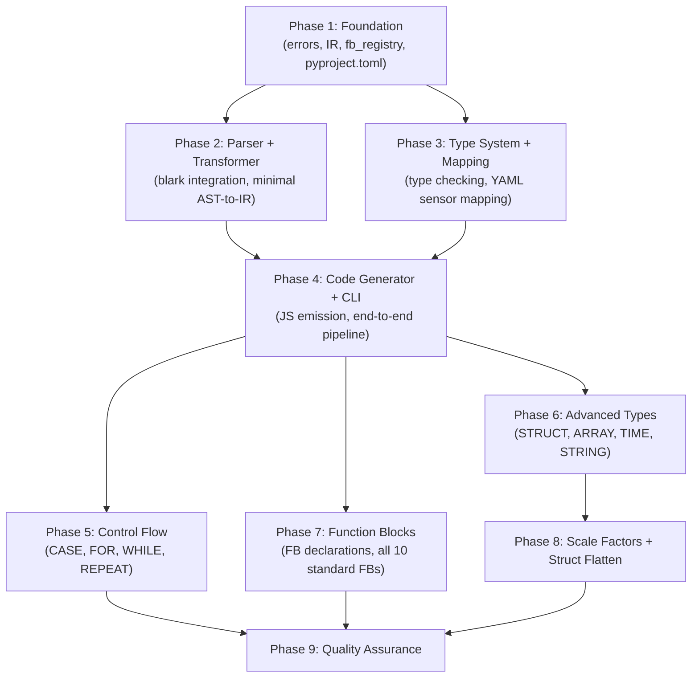
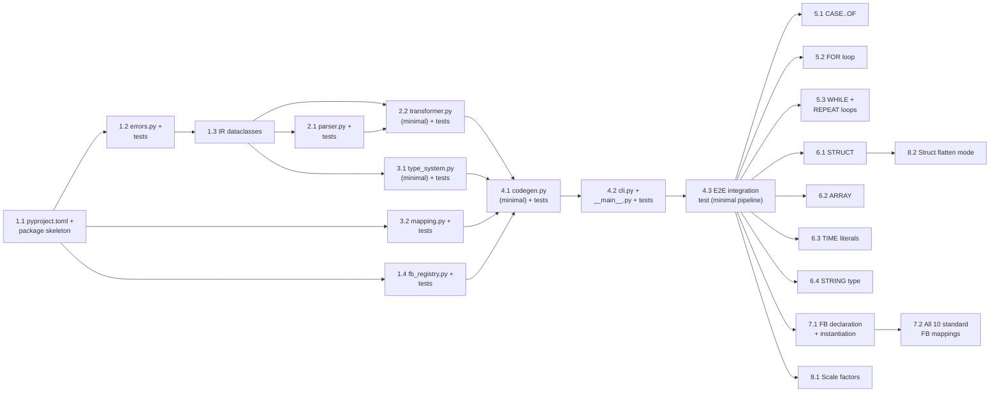

# Work Plan: ST-to-JS Converter (st2js) Implementation

Created Date: 2026-04-04
Type: feature
Estimated Duration: 7 days
Estimated Impact: ~25 new files (new Python package)
Related Issue/PR: N/A

## Related Documents
- Design Doc: [docs/design/st2js-converter-design.md](../design/st2js-converter-design.md)
- ADR: [docs/adr/ADR-0001-st2js-python-blark.md](../adr/ADR-0001-st2js-python-blark.md)

## Objective

Implement the `st2js` tool that converts IEC 61131-3 Structured Text programs into JavaScript compatible with the UniSet2 JScript extension. This eliminates manual ST-to-JS translation, reducing errors and maintenance burden for PLC engineers.

## Background

PLC engineers currently must manually rewrite ST programs in JavaScript to deploy on UniSet2 JScript runtime. The st2js tool automates this conversion using blark for parsing, an internal IR for transformation, and a code generator targeting the `uniset_on_step()` cyclic execution model.

## Phase Structure Diagram

## Task Dependency Diagram

## Risks and Countermeasures

### Technical Risks
- **Risk**: blark grammar rejects pure IEC 61131-3 PROGRAM syntax
  - **Impact**: High -- blocks entire pipeline
  - **Detection**: Phase 2, task 2.1 (parser.py tests with real ST files)
  - **Countermeasure**: Validate in Phase 2 with 5+ representative ST programs; prepare local grammar patch; kill criteria: >30% grammar rewrite needed

- **Risk**: blark AST dataclass API differs from expected structure
  - **Impact**: Medium -- requires transformer rewrite
  - **Detection**: Phase 2, task 2.2 (transformer tests)
  - **Countermeasure**: Pin blark version in pyproject.toml; isolate behind parser.py adapter layer

- **Risk**: QuickJS rejects generated JS syntax
  - **Impact**: High -- generated output unusable
  - **Detection**: Phase 4, task 4.3 (E2E tests)
  - **Countermeasure**: Restrict to ES2020 features; add QuickJS dry-run in E2E tests if available

- **Risk**: Complex STRUCT/ARRAY flattening produces incorrect sensor mapping
  - **Impact**: Medium -- incorrect runtime behavior
  - **Detection**: Phase 8, task 8.2
  - **Countermeasure**: Implement top-level-only mode first (default); add flatten incrementally with dedicated tests

### Schedule Risks
- **Risk**: blark exploration takes longer than expected
  - **Impact**: Delays all downstream phases
  - **Countermeasure**: Time-box blark investigation to 4 hours in Phase 2; fall back to raw lark.Tree traversal if needed

## Implementation Phases

### Phase 1: Foundation (Estimated commits: 4)
**Purpose**: Establish package structure and foundation types used by all modules.

#### Tasks
- [x] **1.1**: Create `pyproject.toml`, package skeleton (`st2js/__init__.py`, `st2js/__main__.py` stub), and `tests/__init__.py`
  - AC: `pip install -e .` succeeds; `python -m st2js --help` prints usage stub
- [x] **1.2**: Implement `errors.py` with all error classes (`STError`, `ParseError`, `TypeError`, `MappingError`, `UnsupportedError`, `STWarning`) and `test_errors.py`
  - AC: Error formatting produces `{file}:{line}:{col}: {type}: {message}` (FR10 support)
- [x] **1.3**: Implement `ir.py` with all IR dataclasses (`IRProgram`, `IRVariable`, `IRFBInstance`, `IRFunctionBlock`, all statement and expression nodes, `IECType` enum)
  - AC: All IR types from Design Doc defined; dataclass construction works in tests
- [x] **1.4**: Implement `fb_registry.py` with all 10 standard FB entries and `test_fb_registry.py`
  - AC: `get_fb_info()` returns correct `FBInfo` for all 10 FBs (TON, TOF, TP, CTU, CTD, CTUD, RS, SR, R_TRIG, F_TRIG); returns `None` for unknown types (FR6 support)

#### Phase Completion Criteria
- [ ] Package installs in editable mode
- [ ] All foundation tests pass
- [ ] IR dataclasses match Design Doc specification

#### Operational Verification Procedures
1. Run `cd extensions/JScript/tools/st2js && pip install -e ".[dev]"` -- verify success
2. Run `python -m st2js --help` -- verify usage message appears
3. Run `pytest tests/test_errors.py tests/test_fb_registry.py -v` -- verify all pass

---

### Phase 2: Parser and Transformer (Estimated commits: 2)
**Purpose**: Integrate blark for ST parsing and implement minimal AST-to-IR transformation. This phase validates the primary risk (blark compatibility).

#### Tasks
- [x] **2.1**: Implement `parser.py` (blark wrapper, `parse_st()` function) and `test_parser.py` with test fixtures (`fixtures/minimal.st`)
  - AC: Parses PROGRAM with VAR/VAR_INPUT/VAR_OUTPUT/END_VAR and simple body; returns ParseResult; raises ParseError with line/col for invalid ST (FR1, FR10 partial)
  - **Risk validation**: Parse 5+ representative ST constructs to confirm blark compatibility
- [x] **2.2**: Implement `transformer.py` minimal subset (PROGRAM declaration, VAR sections, assignment, IF/ELSIF/ELSE) and `test_transformer.py`
  - AC: Transforms blark AST to IRProgram with inputs/outputs/locals/body; handles IRAssignment and IRIfElse (FR1, FR2 partial)

#### Phase Completion Criteria
- [ ] blark successfully parses pure IEC 61131-3 PROGRAM declarations
- [ ] Transformer produces valid IR from parsed AST
- [ ] Parser and transformer tests pass

#### Operational Verification Procedures
1. Create `fixtures/minimal.st` with a simple PROGRAM declaration
2. Run `pytest tests/test_parser.py tests/test_transformer.py -v` -- all pass
3. Verify parser error messages include file:line:col format
4. **Integration Point 1 validation**: Parse 5+ representative ST programs through parser.py

---

### Phase 3: Type System and Mapping (Estimated commits: 2)
**Purpose**: Implement type checking and YAML sensor mapping -- both needed for code generation.

#### Tasks
- [x] **3.1**: Implement `type_system.py` minimal subset (BOOL, INT, DINT, REAL type checking; BOOL-to-INT and REAL-to-INT coercion insertion) and `test_type_system.py`
  - AC: `check_types()` inserts `IRTypeCoercion` nodes for BOOL->arithmetic and REAL->INT assignments (FR4 partial)
- [x] **3.2**: Implement `mapping.py` (`load_mapping()`, `SensorMapping` dataclass, YAML schema validation) and `test_mapping.py` with `fixtures/minimal_mapping.yaml`
  - AC: Loads valid YAML; raises MappingError for invalid/missing fields; supports `inputs`, `outputs`, `options` sections (FR7 support)

#### Phase Completion Criteria
- [ ] Type checker inserts correct coercion nodes
- [ ] Mapping loader validates YAML schema correctly
- [ ] All tests pass

#### Operational Verification Procedures
1. Run `pytest tests/test_type_system.py tests/test_mapping.py -v` -- all pass
2. Verify MappingError raised for YAML missing required `sensor` field
3. Verify type coercion: BOOL used in arithmetic context produces `IRTypeCoercion`

---

### Phase 4: Code Generator and CLI (Estimated commits: 3)
**Purpose**: Complete the minimal end-to-end pipeline -- parse ST, transform, type-check, and emit JS.

#### Tasks
- [x] **4.1**: Implement `codegen.py` minimal subset (variable declarations, assignment, if/else, sensor input/output substitution, `uniset_inputs`/`uniset_outputs` arrays, `uniset_on_step()` wrapper) and `test_codegen.py`
  - AC: Generates JS with `load("uniset2-iec61131.js")`, sensor arrays, variable declarations, and `uniset_on_step()` function (FR9); handles `in_`/`out_` prefix substitution (FR7); emits `if/else if/else` for IRIfElse (FR2 partial)
- [x] **4.2**: Implement `cli.py` (`main()` function, argument parsing) and wire `__main__.py`; add basic CLI test
  - AC: `python -m st2js input.st -m mapping.yaml -o output.js` runs full pipeline; `--strict` and `--struct-flatten` flags accepted; non-zero exit on errors (FR10)
- [x] **4.3**: Add `test_e2e.py` with minimal end-to-end test (ST + YAML -> JS string comparison)
  - AC: Minimal ST PROGRAM converts to expected JS output; generated JS structure matches Design Doc FR9 format

#### Phase Completion Criteria
- [ ] End-to-end pipeline works for minimal ST program
- [ ] CLI accepts all specified flags
- [ ] Generated JS follows correct structure (load, inputs, outputs, vars, on_step)

#### Operational Verification Procedures
1. Run `python -m st2js tests/fixtures/minimal.st -m tests/fixtures/minimal_mapping.yaml -o /tmp/test.js`
2. Inspect `/tmp/test.js` -- verify structure: `load()`, `uniset_inputs`, `uniset_outputs`, `uniset_on_step()`
3. Run `pytest tests/ -v` -- all tests pass
4. **Integration Point 2 validation**: Verify minimal pipeline produces valid JS

---

### Phase 5: Control Flow Constructs (Estimated commits: 3)
**Purpose**: Add remaining control flow: CASE, FOR, WHILE, REPEAT across transformer + codegen.

#### Tasks
- [x] **5.1**: Add CASE..OF support (transformer: `IRCase`; codegen: `switch/case` with `break`) and tests
  - AC: ST `CASE x OF` emits JS `switch(x) { case ...: ...; break; }` (FR2)
- [x] **5.2**: Add FOR loop support (transformer: `IRForLoop`; codegen: `for` with bounds/step) and tests
  - AC: ST `FOR i := 1 TO 10 BY 2 DO` emits correct JS `for` loop (FR2)
- [x] **5.3**: Add WHILE and REPEAT..UNTIL support (transformer: `IRWhileLoop`, `IRRepeatLoop`; codegen: `while`, `do..while`) and tests
  - AC: ST `WHILE` emits JS `while`; ST `REPEAT..UNTIL` emits JS `do { } while(!condition)` (FR2)

#### Phase Completion Criteria
- [x] All 5 control flow types (IF, CASE, FOR, WHILE, REPEAT) convert correctly
- [x] E2E test with `fixtures/control_flow.st` passes

#### Operational Verification Procedures
1. Create `fixtures/all_control_flow.st` with all control flow constructs
2. Run `pytest tests/test_transformer.py tests/test_codegen.py tests/test_e2e.py -v` -- all pass
3. Inspect generated JS for each control flow -- verify correct JS equivalent

---

### Phase 6: Advanced Types (Estimated commits: 4)
**Purpose**: Add STRUCT, ARRAY, TIME literal, and STRING type support.

#### Tasks
- [x] **6.1**: Add STRUCT support (transformer: struct declarations, `IRFieldAccess`; codegen: JS object literal and property access) and tests
  - AC: ST STRUCT type declaration emits JS object literal; field access emits `.field` (FR5)
- [x] **6.2**: Add ARRAY support (transformer: array declarations, `IRArrayAccess`; codegen: JS Array initialization and index access) and tests
  - AC: ST `ARRAY[1..10] OF INT` emits JS `Array(10).fill(0)`; index access emits `arr[i]` (FR5)
- [x] **6.3**: Add TIME literal support (type_system: TIME-to-ms conversion; codegen: integer emission) and tests
  - AC: `T#3s` becomes `3000`, `T#500ms` becomes `500`, `T#2m` becomes `120000` (FR4)
- [x] **6.4**: Add STRING type support (type_system: STRING type; codegen: string literal emission) and tests
  - AC: STRING variables declared with empty string default; string literals emitted with JS quotes (FR4)

#### Phase Completion Criteria
- [x] STRUCT, ARRAY, TIME, STRING all convert correctly
- [x] E2E test with `fixtures/struct_array.st` passes

#### Operational Verification Procedures
1. Create `fixtures/struct_array.st` with STRUCT and ARRAY usage
2. Run `pytest tests/ -v` -- all pass
3. Verify TIME literals convert to correct millisecond values

---

### Phase 7: Function Block Support (Estimated commits: 2)
**Purpose**: Add FUNCTION_BLOCK declarations and standard FB instantiation/call mapping.

#### Tasks
- [x] **7.1**: Add FUNCTION_BLOCK declaration support (transformer: `IRFunctionBlock`; codegen: JS class with constructor and `execute()` method) and tests
  - AC: ST FUNCTION_BLOCK emits JS class; VAR becomes constructor; body becomes `execute()` (FR1)
- [x] **7.2**: Add all 10 standard FB instantiation and call mapping (transformer: `IRFBCall` with fb_registry lookup; codegen: `new FBType(args)` and `fb.update(params)`) and E2E tests with `fixtures/fb_calls.st`
  - AC: All 10 FBs (TON, TOF, TP, CTU, CTD, CTUD, RS, SR, R_TRIG, F_TRIG) generate correct constructor and `update()` calls per uniset2-iec61131.js API; unknown FB type raises error (FR6)

#### Phase Completion Criteria
- [ ] FUNCTION_BLOCK declarations generate correct JS classes
- [ ] All 10 standard FB types generate correct instantiation and call code
- [ ] E2E test with `fixtures/fb_calls.st` passes

#### Operational Verification Procedures
1. Create `fixtures/fb_calls.st` with standard FB usage
2. Run `pytest tests/ -v` -- all pass
3. **Integration Point 3 validation**: Verify generated FB calls match documented `update()` signatures from `IEC61131.md`

---

### Phase 8: Scale Factors and Struct Flatten (Estimated commits: 2)
**Purpose**: Add REAL scale factor math and struct-to-sensor flattening.

#### Tasks
- [x] **8.1**: Add scale factor support (codegen: `in_Sensor / N` for input, `Math.round(var * N)` for output) and tests
  - AC: REAL input with `scale: 100` emits `varName = in_SensorName / 100`; REAL output with `scale: 100` emits `out_SensorName = Math.round(varName * 100)` (FR8)
- [x] **8.2**: Add struct flatten mode (mapping: `struct_flatten: true` option; codegen: separate sensor entries per struct field) and tests
  - AC: With `--struct-flatten`, struct fields become individual sensor entries in `uniset_inputs`/`uniset_outputs` (FR7)

#### Phase Completion Criteria
- [x] Scale factor math generates correct division/multiplication
- [x] Struct flatten mode produces individual sensor entries per field

#### Operational Verification Procedures
1. Run E2E test with REAL sensors and scale factors -- verify generated math
2. Run E2E test with struct flatten enabled -- verify flattened sensor arrays
3. Run `pytest tests/ -v` -- all pass

---

### Phase 9: Quality Assurance (Estimated commits: 2)
**Purpose**: Final quality gate -- all acceptance criteria verified, full test coverage, documentation.

#### Tasks
- [x] Verify all Design Doc acceptance criteria achieved (FR1-FR10 checklist)
- [x] Add `fixtures/thermostat.st` and `fixtures/thermostat_mapping.yaml` -- full example E2E test
- [x] Quality checks: run `pytest --cov=st2js --cov-report=term-missing` -- verify 90%+ coverage for transformer.py, codegen.py, type_system.py
- [x] Verify error messages for all error types (ParseError, UnsupportedError, TypeError, MappingError)
- [x] Verify warnings for non-fatal issues (YAML references variable not in ST)
- [x] Review generated JS against `uniset2-iec61131.js` API and `main.js` patterns

#### Phase Completion Criteria
- [x] All acceptance criteria from Design Doc achieved
- [x] Coverage: 90%+ for core modules (transformer, codegen, type_system)
- [x] All E2E tests pass including thermostat full example
- [x] Error reporting verified for all error types with correct file:line:col format

#### Operational Verification Procedures
1. Run `pytest tests/ -v --cov=st2js --cov-report=term-missing` -- all pass, coverage targets met
2. Run `python -m st2js tests/fixtures/thermostat.st -m tests/fixtures/thermostat_mapping.yaml -o /tmp/thermostat.js`
3. Inspect `/tmp/thermostat.js` -- verify complete, correct JS output
4. Run `python -m st2js tests/fixtures/invalid.st -m tests/fixtures/minimal_mapping.yaml` -- verify error with line/col
5. Verify generated JS against `extensions/JScript/js/uniset2-iec61131.js` API signatures

### Quality Assurance Summary
- [x] All tests pass (`pytest tests/ -v`)
- [x] Static check: no import errors, no undefined references
- [x] Coverage 90%+ for core modules
- [x] All Design Doc acceptance criteria satisfied

## Completion Criteria
- [ ] All phases completed (Phase 1-9)
- [ ] Each phase's operational verification procedures executed
- [ ] Design Doc acceptance criteria satisfied (FR1-FR10, all AC checkboxes)
- [ ] All tests pass (unit + integration + E2E)
- [ ] Coverage target met (90%+ core modules)
- [ ] User review approval obtained

## Acceptance Criteria Traceability

| AC | Description | Phase | Tasks |
|----|-------------|-------|-------|
| FR1 | Parse PROGRAM/FUNCTION_BLOCK | P2, P7 | 2.1, 2.2, 7.1 |
| FR2 | Control flow (IF, CASE, FOR, WHILE, REPEAT) | P2, P4, P5 | 2.2, 4.1, 5.1-5.3 |
| FR3 | Expressions (arithmetic, boolean, comparison) | P2, P4 | 2.2, 4.1 |
| FR4 | Data types (BOOL, INT, DINT, REAL, TIME, STRING) | P3, P6 | 3.1, 6.3, 6.4 |
| FR5 | STRUCT and ARRAY | P6 | 6.1, 6.2 |
| FR6 | Standard FB mapping | P1, P7 | 1.4, 7.1, 7.2 |
| FR7 | Sensor mapping from YAML | P3, P4 | 3.2, 4.1 |
| FR8 | REAL scale factors | P8 | 8.1 |
| FR9 | Output JS file format | P4 | 4.1, 4.2 |
| FR10 | Error reporting with line/col | P1, P2 | 1.2, 2.1 |

## Progress Tracking

### Phase 1: Foundation
- Start:
- Complete:
- Notes:

### Phase 2: Parser and Transformer
- Start: 2026-04-04
- Complete:
- Notes: **Critical risk validation phase** -- blark 0.8.3 compatibility CONFIRMED. All 7 ST constructs (PROGRAM, FUNCTION_BLOCK, CASE, FOR, WHILE, REPEAT, FB instantiation) parse successfully. Note: `internal` is a reserved keyword in blark/lark grammar. blark stores parse errors in result.exception (not raised), with lark UnexpectedCharacters/UnexpectedEOF having line/column attrs.

### Phase 3: Type System and Mapping
- Start: 2026-04-04
- Complete:
- Notes: Task 3.2 (mapping.py) completed -- 18 tests passing. SensorEntry/SensorMapping/MappingOptions dataclasses, load_mapping/load_mapping_from_string functions, YAML validation with MappingError for missing sensor/invalid type/invalid scale. Task 3.1 (type_system.py) completed -- 25 tests passing. check_types() inserts IRTypeCoercion for BOOL->INT in arithmetic and REAL->INT/DINT on assignment; resolve_type() handles literals, vars, binary ops, unary ops, coercion nodes; STTypeError raised for STRING in arithmetic.

### Phase 4: Code Generator and CLI
- Start: 2026-04-04
- Complete: 2026-04-04
- Notes: Task 4.1 (codegen.py) completed -- 34 tests passing. CodeGenerator class with generate() function, operator mapping (= -> ===, AND -> &&, etc.), in_/out_ prefix substitution, uniset_inputs/uniset_outputs arrays, local variable declarations, if/else if/else emission, type coercion (Math.round for REAL->INT, ternary for BOOL->INT). Integration test with minimal.st + minimal_mapping.yaml passes. Task 4.2 (cli.py) completed -- 15 CLI tests passing. main() function with argparse, full pipeline wiring (parse->transform->check_types->generate), error handling with STError catch, --strict/--struct-flatten flags, -o output file support. Task 4.3 (test_e2e.py) completed -- 20 E2E tests passing. Full pipeline verification, CLI subprocess tests, error case tests. Total: 249 tests passing.

### Phase 5: Control Flow Constructs
- Start: 2026-04-04
- Complete: 2026-04-04
- Notes: Tasks 5.1-5.3 completed. Added CASE/FOR/WHILE/REPEAT transform and codegen support. 131 tests passing across transformer, codegen, and E2E test files. Created control_flow.st fixture with all 4 control flow types. Pre-existing test_transformer_fb.py failures (21 failed, 6 errors) are from Phase 7 (Function Block Support) which is not yet implemented.

### Phase 6: Advanced Types
- Start: 2026-04-04
- Complete: 2026-04-04
- Notes: Tasks 6.1-6.4 completed. Transformer: TYPE..STRUCT declarations registered and resolved to IRVariable with struct_fields; ARRAY[n..m] OF T parsed to IRVariable with array_element_type/array_size/array_lower_bound; STRING type and string literals ('hello') handled; TIME initial values via Duration->ms conversion. Codegen: STRUCT -> JS object literal {field: default}; ARRAY -> new Array(size).fill(default); array index -> arr[i - lower_bound]; STRING -> "value" with JS quotes; TIME -> plain integer (ms). 37 new tests. Total: 411 passing (excluding 8 pre-existing Phase 8 struct_flatten tests).

### Phase 7: Function Block Support
- Start: 2026-04-04
- Complete: 2026-04-04
- Notes: Tasks 7.1 and 7.2 completed. Transformer: FB instance detection via fb_registry, FunctionCallStatement -> IRFBCall with named param extraction, MultiElementVariable -> IRFieldAccess, Duration -> TIME literal (ms), FUNCTION_BLOCK -> IRFunctionBlock, constructor arg extraction (PT/PV) from FB calls. Codegen: IRFBInstance -> const new FBType(args), IRFBCall -> inst.update(params) with fb_registry arg ordering, IRFieldAccess -> obj.field, IRFunctionBlock -> JS class with constructor(this.vars) + execute() method. Type system updated to resolve FB output field types via fb_registry. 356 tests passing (107 new FB tests).

### Phase 8: Scale Factors and Struct Flatten
- Start: 2026-04-04
- Complete: 2026-04-04
- Notes: Task 8.1 (scale factors) completed -- 18 new tests. Codegen emits `let var = in_Sensor / scale;` at top of uniset_on_step() for scaled inputs, `out_Sensor = Math.round(var * scale);` at bottom for scaled outputs. Body uses ST variable names directly. Integer scale values emitted without decimal point. Task 8.2 (struct flatten) completed -- 12 new tests. When struct_flatten enabled, dotted mapping entries (struct.field) are grouped by struct name. Input structs reconstructed as JS object literals at top of uniset_on_step(), output struct fields extracted at bottom. Non-struct entries unaffected. 386 total tests passing.

### Phase 9: Quality Assurance
- Start: 2026-04-04
- Complete: 2026-04-04
- Notes: Created thermostat.st + thermostat_mapping.yaml fixtures. Added TestThermostatE2E (18 tests) and TestErrorReportingE2E (8 tests) to test_e2e.py. Fixed type_system.py to resolve STRUCT field types (config.setpoint was returning VOID). 448 total tests passing. Coverage: transformer 92%, codegen 96%, type_system 90%, overall 94%. parser.py at 84% (generic exception handlers), __main__.py at 0% (entry point only). All error types verified with file:line:col format.

## Notes

- All work is in `extensions/JScript/tools/st2js/` -- no existing UniSet2 code is modified
- Phases 5, 6, 7, and 8 can be parallelized after Phase 4 completes (they are independent feature slices)
- If blark compatibility fails in Phase 2, fall back to raw lark.Tree traversal (ADR-0001 Alternative 1)
- Python 3.10+ required (dataclass features, type union syntax)
- Test fixtures directory: `extensions/JScript/tools/st2js/tests/fixtures/`
