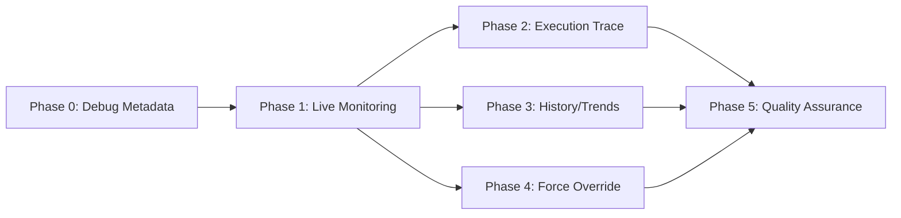
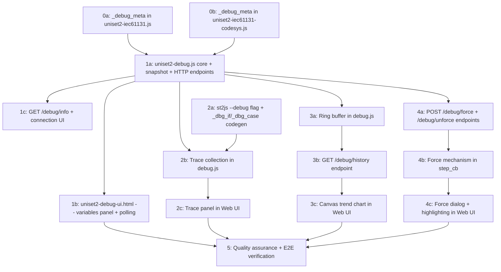

# Work Plan: JScript Debug Visualizer Implementation

Created Date: 2026-04-05
Type: feature
Estimated Duration: 5-7 days
Estimated Impact: 6 files (2 new JS, 1 new HTML, 2 modified JS libs, 1 modified Python)
Related Issue/PR: story/jscript-IEC61131

## Related Documents
- Design Doc: [docs/design/jscript-debug-visualizer-design.md]

## Verification Strategy (from Design Doc)

### Correctness Proof Method
- **Correctness definition**: Debug visualizer displays live variable values, execution trace, history trends, and supports force override -- all via HTTP polling from a browser
- **Verification method**: Manual E2E test with a thermostat-like JS script running on JScript + browser pointed at debug UI
- **Verification timing**: After each phase, verify the phase's feature set works end-to-end

### Early Verification Point
- **First verification target**: Phase 1 -- `GET /debug/snapshot` returns valid JSON with `in_*`/`out_*` variables from a running JScript process
- **Success criteria**: Browser shows live-updating variable table with value change highlighting
- **Failure response**: Debug HTTP handler architecture needs rethinking if `uniset.http_start()` cannot serve JSON endpoints

## Objective

Provide a browser-based debugger/visualizer for JavaScript programs running on UniSet2 JScript (QuickJS). Enables live monitoring, execution trace, history/trends, and force override without modifying C++ code.

## Background

Currently, debugging JScript programs requires console logging or external tools. The JScript engine already provides `uniset.http_start()` (JHttpServer) for HTTP serving. This work leverages the existing HTTP infrastructure to build a pure-JS debug layer with a single-file Web UI.

## Risks and Countermeasures

### Technical Risks
- **Risk**: `uniset.http_start()` may not support routing multiple handlers or POST body parsing
  - **Impact**: Cannot implement `/debug/*` endpoints alongside user HTTP handlers
  - **Countermeasure**: Use `uniset2-mini-http-router.js` for path-based dispatch; test POST body parsing early in Phase 1
- **Risk**: `globalThis` scan may be slow with many properties
  - **Impact**: Snapshot collection could add latency to the HTTP response
  - **Countermeasure**: Lazy evaluation (scan only on HTTP request); cache property list with periodic refresh
- **Risk**: Ring buffer memory for 50 vars x 1000 cycles (~400KB) may be significant for constrained environments
  - **Impact**: Memory pressure on JScript process
  - **Countermeasure**: Configurable `history_depth`; default 1000 is conservative

### Schedule Risks
- **Risk**: Canvas chart implementation (Phase 3) could take longer than expected
  - **Impact**: Delays Phase 3 completion
  - **Countermeasure**: Start with minimal chart (fixed Y-scale, no zoom); enhance iteratively

## Phase Structure

## Task Dependencies

Note: Phase 2, 3, and 4 are independent of each other (depend only on Phase 1). They can be implemented in any order. Phase 2 additionally depends on st2js changes (T2A).

## Implementation Phases

### Phase 0: Debug Metadata for Existing Libraries (Estimated commits: 1-2)

**Purpose**: Add `_debug_meta` static properties to all FB classes so the debugger can render them with semantic meaning (progress bars, gauges, indicators).

**Verification**: L3 -- JS files load without errors in QuickJS; existing tests still pass.

#### Tasks
- [ ] **0a**: Add `_debug_meta` to all FB classes in `extensions/JScript/js/uniset2-iec61131.js`
  - TON, TOF, TP: `type:"timer"`, `display:"progress"`, fields Q/ET/PT
  - CTU, CTD, CTUD: `type:"counter"`, `display:"gauge"`, fields Q/CV/PV (CTUD: QU/QD/CV/PV)
  - SR, RS: `type:"bistable"`, `display:"indicator"`, fields Q1
  - R_TRIG, F_TRIG: `type:"edge"`, `display:"indicator"`, fields Q
  - **Completion**: All 10 FB classes have `_debug_meta`; existing tests pass
- [ ] **0b**: Add `_debug_meta` to all FB classes in `extensions/JScript/js/uniset2-iec61131-codesys.js`
  - PID: `type:"controller"`, `display:"chart"`, fields Y/LIMITS_ACTIVE/OVERFLOW
  - BLINK: `type:"signal"`, `display:"indicator"`, fields OUT
  - HYSTERESIS: `type:"analog"`, `display:"indicator"`, fields OUT
  - LIMITALARM: `type:"alarm"`, `display:"indicator"`, fields O/U/IL
  - LIN_TRAFO: `type:"analog"`, `display:"value"`, fields OUT
  - RAMP_REAL: `type:"analog"`, `display:"value"`, fields OUT/BUSY
  - DERIVATIVE: `type:"analog"`, `display:"value"`, fields OUT
  - INTEGRAL: `type:"analog"`, `display:"value"`, fields OUT/OVERFLOW/RESET
  - **Completion**: All Codesys FB classes have `_debug_meta`; existing tests pass

#### Phase Completion Criteria
- [ ] All FB classes in both libraries have `_debug_meta` with correct field descriptors
- [ ] `make check` in `extensions/JScript/tests/` passes (no regressions)

---

### Phase 1: Live Monitoring (Estimated commits: 2-3)

**Purpose**: Core debug infrastructure -- variable snapshot, HTTP endpoints, and basic Web UI with live variable display.

**Verification**: L1 -- Run a test JS script with `uniset_debug_start(8088)`, open browser to `http://localhost:8088/debug/ui`, see live variable table updating.

#### Tasks
- [ ] **1a**: Create `extensions/JScript/js/uniset2-debug.js` -- core debug module
  - `uniset_debug_start(port, opts)` function using `uniset.http_start()`
  - Variable auto-detection: scan `globalThis` for `in_*`, `out_*`, FB instances
  - `uniset_debug_watch(name, getter)` for manual registration
  - `GET /debug/snapshot` endpoint returning JSON with `cycle`, `ts`, `dt_ms`, `vars`, `forced`, `cycles_missed`
  - `GET /debug/info` endpoint returning version, program name, cycle time, var count
  - `GET /debug/ui` endpoint serving the HTML file
  - `POST /debug/config` endpoint for runtime settings
  - Metadata resolution: `_program_meta` -> `_debug_meta` -> generic fallback
  - **Completion**: Endpoints return correct JSON; snapshot includes all detected variables
- [ ] **1b**: Create `extensions/JScript/js/uniset2-debug-ui.html` -- basic Web UI
  - Single-file HTML with inline JS/CSS
  - Variables panel: table with Name/Value/Type/Changed columns
  - Grouping: Inputs / Outputs / Locals / FB Instances (using `_program_meta` if available)
  - FB status cards: progress bar for timers (ET/PT), gauge for counters (CV/PV), indicator for bistable
  - Value change highlighting (flash green/red)
  - `fetch()` polling loop with configurable interval (default 300ms)
  - **Completion**: Browser shows live-updating grouped variable table with FB cards
- [ ] **1c**: Control bar in Web UI
  - Connection status display with host/port
  - Cycle counter and frequency display
  - Cycles missed indicator
  - Pause/resume polling button
  - Poll interval setting
  - **Completion**: Control bar functional with pause/resume and interval adjustment

#### Phase Completion Criteria
- [ ] `GET /debug/snapshot` returns valid JSON with all `in_*`/`out_*` variables
- [ ] `GET /debug/info` returns server metadata
- [ ] Web UI displays live variable values with grouping and FB cards
- [ ] Value changes are visually highlighted
- [ ] Polling can be paused and interval adjusted from UI

---

### Phase 2: Execution Trace (Estimated commits: 2-3)

**Purpose**: Add `--debug` flag to st2js that instruments IF/CASE with trace calls; collect and display trace in Web UI.

**Verification**: L1 -- Convert a ST program with `st2js --debug`, run it with debug module, see trace panel showing which branches fired.

#### Tasks
- [ ] **2a**: Add `--debug` flag to st2js converter
  - Add `--debug` CLI flag in `st2js/cli.py`
  - In `st2js/codegen.py`: when `--debug` enabled:
    - Emit `_dbg_*` stub definitions at top of output (for standalone use without debug.js)
    - Wrap IF conditions with `_dbg_if(line, cond)`
    - Wrap CASE selectors with `_dbg_case(line, value)`
    - Emit `_dbg_begin_cycle()` at start of `uniset_on_step()`
    - Emit `_dbg_end_cycle()` at end of `uniset_on_step()`
    - Generate `globalThis._program_meta` with inputs, outputs, locals, fb_instances, enums, scales
  - **Completion**: `st2js --debug` produces valid JS with trace instrumentation; generated code runs correctly both with and without debug.js loaded
- [ ] **2b**: Trace collection in `uniset2-debug.js`
  - Implement `_dbg_if(line, cond)`, `_dbg_case(line, value)`, `_dbg_begin_cycle()`, `_dbg_end_cycle()`
  - Collect trace events per cycle into array
  - Include `trace` array in `/debug/snapshot` response
  - **Completion**: Snapshot includes trace data when instrumented code is running
- [ ] **2c**: Trace panel in Web UI
  - Display current cycle's trace events
  - Format: `IF @42: true`, `CASE @55: -> 1`
  - Color coding: green for true, red for false
  - Last N cycles with expand/collapse
  - **Completion**: Trace panel shows branch decisions with color coding

#### Phase Completion Criteria
- [ ] `st2js --debug` generates correct instrumented JS
- [ ] Generated JS works without debug.js (stubs are no-ops)
- [ ] Trace events appear in `/debug/snapshot` response
- [ ] Web UI trace panel shows branch decisions with color coding
- [ ] st2js existing tests pass (no regressions from `--debug` additions)

---

### Phase 3: History / Trends (Estimated commits: 2-3)

**Purpose**: Ring buffer for variable history; canvas-based trend charts in Web UI.

**Verification**: L1 -- Select a variable in the UI, see a live-updating trend chart with configurable time window.

#### Tasks
- [ ] **3a**: Ring buffer implementation in `uniset2-debug.js`
  - Fixed-size ring buffer (configurable `history_depth`, default 1000)
  - Store `[timestamp, value]` pairs per variable per cycle
  - Buffer fills regardless of client connection (late-connect history review)
  - Fill happens in snapshot collection (httpLoop phase)
  - **Completion**: Ring buffer stores variable history; memory usage stays within ~400KB for 50 vars x 1000 cycles
- [ ] **3b**: `GET /debug/history` endpoint
  - Query params: `var` (variable name), `depth` (number of entries, default all)
  - Returns `{ "var": "...", "data": [[ts, val], ...] }`
  - **Completion**: Endpoint returns correct time-series data from ring buffer
- [ ] **3c**: Canvas trend chart in Web UI
  - Canvas-based line chart (no external dependencies)
  - Click variable in table to add/remove from chart
  - Multiple variables with different colors
  - Auto-scaling Y axis
  - Time window selector: 30s / 1m / 5m / all
  - Pause/resume live updates
  - **Completion**: Chart displays selected variables with auto-scaling and time window control

#### Phase Completion Criteria
- [ ] Ring buffer stores history for all tracked variables
- [ ] `GET /debug/history` returns correct time-series data
- [ ] Trend chart displays with auto-scaling and time window selection
- [ ] Multiple variables can be plotted simultaneously

---

### Phase 4: Force Override (Estimated commits: 1-2)

**Purpose**: Allow setting/releasing forced variable values from the browser for debugging.

**Verification**: L1 -- Force an input variable from UI, observe the program uses the forced value; release force, program resumes using real value.

#### Tasks
- [ ] **4a**: Force/unforce HTTP endpoints in `uniset2-debug.js`
  - `POST /debug/force` with body `{ "var": "...", "value": ... }`
  - `POST /debug/unforce` with body `{ "var": "..." }`
  - Maintain `_forced` Map internally
  - Return error for unknown variables
  - **Completion**: Endpoints accept/release force requests; forced list included in snapshot
- [ ] **4b**: Force mechanism via `uniset.step_cb()`
  - Register step callback that runs BEFORE `uniset_on_step()`
  - Apply all forced values to `globalThis` in step_cb
  - Document v1 limitation: output variables may be overwritten by program during execution
  - **Completion**: Forced input values are applied before program logic; visible in snapshot
- [ ] **4c**: Force dialog and highlighting in Web UI
  - Right-click variable to open force dialog
  - Input field for forced value with type validation
  - Forced variables highlighted in variable table (distinct color/icon)
  - Unforce button per forced variable
  - **Completion**: Force workflow works end-to-end from UI

#### Phase Completion Criteria
- [ ] Force/unforce endpoints work correctly
- [ ] Forced values applied before `uniset_on_step()` via step_cb
- [ ] UI shows force dialog and highlights forced variables
- [ ] Force can be released from UI

---

### Phase 5: Quality Assurance (Required) (Estimated commits: 1)

**Purpose**: Cross-cutting quality assurance, integration testing, and Design Doc consistency verification.

#### Tasks
- [ ] Verify all Design Doc acceptance criteria achieved:
  - [ ] Mode 1 (any JS script): live vars, FB status, history, force -- all work
  - [ ] Mode 2 (st2js --debug): all Mode 1 features + execution trace
  - [ ] Mode 3 (manual trace): selective `_dbg_if` in hand-written JS works
- [ ] E2E test: thermostat example script with debug visualizer
  - Run `uniset2-jscript` with thermostat.js + debug module
  - Verify all 4 UI panels function correctly
  - Verify force override on input variable affects program behavior
  - Verify trend chart shows historical data
- [ ] Performance verification:
  - [ ] Snapshot overhead < 1ms per cycle (for 50 vars)
  - [ ] Trace overhead < 0.1ms per branch
  - [ ] No debug module loaded -> `_dbg_*` stubs have zero overhead
- [ ] Verify `_debug_meta` fallback chain: `_program_meta` -> `_debug_meta` -> generic
- [ ] Verify `--debug` generated JS works without debug.js loaded (stubs only)
- [ ] Run `make check` in `extensions/JScript/tests/` -- all pass
- [ ] Run st2js test suite -- all pass
- [ ] Verify HTML file < 50KB
- [ ] Browser compatibility: test in Chrome and Firefox

#### Phase Completion Criteria
- [ ] All E2E scenarios pass
- [ ] All existing tests pass (no regressions)
- [ ] Performance targets met
- [ ] Design Doc acceptance criteria satisfied

## Affected Files Summary

| File | Action | Phase |
|------|--------|-------|
| `extensions/JScript/js/uniset2-iec61131.js` | Modify (add `_debug_meta`) | 0 |
| `extensions/JScript/js/uniset2-iec61131-codesys.js` | Modify (add `_debug_meta`) | 0 |
| `extensions/JScript/js/uniset2-debug.js` | **New** | 1-4 |
| `extensions/JScript/js/uniset2-debug-ui.html` | **New** | 1-4 |
| `extensions/JScript/tools/st2js/st2js/cli.py` | Modify (add `--debug` flag) | 2 |
| `extensions/JScript/tools/st2js/st2js/codegen.py` | Modify (`_dbg_*` instrumentation + `_program_meta`) | 2 |

## Completion Criteria
- [ ] All phases completed (0-5)
- [ ] Design Doc acceptance criteria satisfied
- [ ] All existing tests pass (no regressions)
- [ ] Debug visualizer works in Mode 1, Mode 2, and Mode 3
- [ ] Web UI is a single file < 50KB
- [ ] User review approval obtained

## Progress Tracking

### Phase 0
- Start:
- Complete:
- Notes:

### Phase 1
- Start:
- Complete:
- Notes:

### Phase 2
- Start:
- Complete:
- Notes:

### Phase 3
- Start:
- Complete:
- Notes:

### Phase 4
- Start:
- Complete:
- Notes:

### Phase 5
- Start:
- Complete:
- Notes:

## Notes
- Pure JS implementation -- no C++ changes required
- All HTTP endpoints served through existing `uniset.http_start()` / JHttpServer
- Phases 2, 3, 4 are independent of each other (all depend only on Phase 1)
- The `--debug` flag in st2js is backward compatible: generated code works with or without debug.js
- Ring buffer fills continuously even without a connected client (useful for late-connect history)
- v1 limitation: force override on output variables may be overwritten by program logic during the cycle
