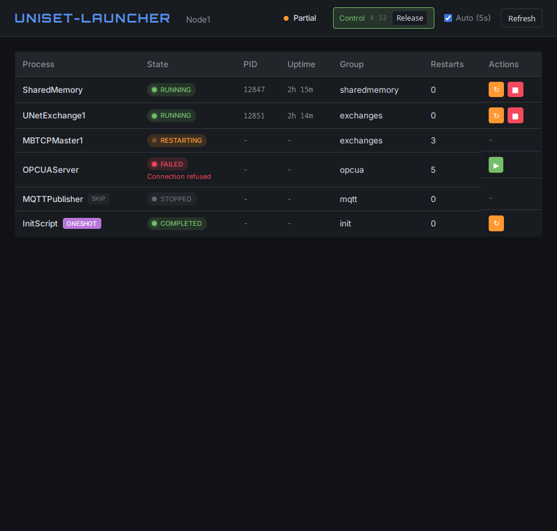

# UniSet2 Launcher

Менеджер жизненного цикла процессов для распределённых систем UniSet2. Управляет последовательностью запуска, мониторингом состояния и автоматическим перезапуском.

## Возможности

- **Упорядоченный запуск**: Запуск процессов в порядке зависимостей (naming → SM → обмены)
- **Мониторинг состояния**: Отслеживание работоспособности процессов и автоматический перезапуск при сбое
- **Проверка готовности**: Ожидание готовности процессов (TCP порт, CORBA объект, HTTP endpoint)
- **REST API**: HTTP API для мониторинга статуса и управления процессами
- **Конфигурация**: XML-конфигурация, интегрированная с configure.xml UniSet2
- **Фильтрация по узлам**: Запуск определённых процессов на определённых узлах
- **Флаг пропуска**: Временное отключение процессов без удаления из конфига (`skip="1"`)

## Использование

```bash
uniset2-launcher --confile configure.xml [--localNode Node1] [ОПЦИИ] [-- ARGS...]
```

### Проброс аргументов

Неизвестные launcher'у аргументы автоматически пробрасываются в дочерние процессы:

```bash
# --uniset-port и --lockDir будут переданы всем дочерним процессам
uniset2-launcher --confile config.xml --uniset-port 2809 --lockDir /tmp
```

Также можно явно указать аргументы для проброса через `--`:

```bash
uniset2-launcher --confile config.xml -- --custom-arg value
```

### Опции

| Опция | Описание |
|-------|----------|
| `--confile FILE` | Конфигурационный файл (обязательно) |
| `--localNode NAME` | Имя локального узла (по умолчанию: из атрибута `localNode` в конфиге) |
| `--launcher-name NAME` | Имя секции Launcher в конфиге |
| `--http-port PORT` | Порт HTTP API (0 = отключено) |
| `--http-host HOST` | Хост HTTP API (по умолчанию: 0.0.0.0) |
| `--http-whitelist IPs` | Whitelist IP/подсетей через запятую |
| `--http-blacklist IPs` | Blacklist IP/подсетей через запятую |
| `--read-token TOKEN` | Bearer-токен для доступа к чтению (UI, GET API) |
| `--control-token TOKEN` | Bearer-токен для управления (POST restart/stop/start) |
| `--html-template FILE` | Пользовательский HTML-шаблон |
| `--health-interval MS` | Интервал проверки состояния в мс (по умолчанию: 5000) |
| `--stop-timeout MS` | Таймаут graceful shutdown в мс (по умолчанию: 5000) |
| `--no-monitor` | Не мониторить процессы после запуска |
| `--runlist`, `--dry-run` | Показать что будет запущено без реального запуска |
| `--verbose` | Подробный вывод |

## Конфигурация

Добавьте секцию `<Launcher>` в ваш `configure.xml`.

### Упрощённая конфигурация (рекомендуется)

С использованием шаблонов процессов можно использовать минимальную конфигурацию:

```xml
<Launcher name="Launcher1"
          commonArgs="--confile ${CONFFILE} --localNode ${NODE_NAME}">
    <ProcessGroups>
        <group name="sharedmemory" order="1">
            <process name="SharedMemory"/>
        </group>
        <group name="exchanges" order="2" depends="sharedmemory">
            <process name="UNetExchange1"/>
            <process name="MBTCPMaster1"/>
        </group>
    </ProcessGroups>
</Launcher>
```

Launcher автоматически:
- Определяет тип процесса по префиксу имени (SharedMemory*, UNet*, MBTCPMaster* и т.д.)
- Устанавливает правильную команду (`uniset2-smemory`, `uniset2-unetexchange` и т.д.)
- Устанавливает аргументы по умолчанию (`--smemory-id`, `--unet-name` и т.д.)
- Настраивает проверку готовности через CORBA (`corba:ProcessName`)
- Добавляет `--smemory-id` для процессов, которым нужен SharedMemory

#### Использование атрибута `type`

Для нестандартных имён укажите тип явно:

```xml
<process name="ModbusTCP1" type="MBTCPMaster"/>
<process name="SM_Main" type="SharedMemory"/>
```

#### Частичное переопределение

Переопределение отдельных атрибутов с сохранением значений из шаблона:

```xml
<process name="SharedMemory" readyTimeout="60000" critical="true"/>
<process name="UNetExchange1" nodeFilter="Node1,Node2"/>
```

### Полная конфигурация (Legacy)

Для полного контроля или пользовательских процессов:

```xml
<Launcher name="Launcher1"
          healthCheckInterval="5000"
          restartDelay="1000"
          maxRestartDelay="30000"
          httpPort="8080"
          commonArgs="--confile ${CONFFILE} --localNode ${NODE_NAME}">

    <ProcessGroups>
        <!-- Группа 0: Naming Service (запускается первой) -->
        <group name="naming" order="0">
            <process name="omniNames"
                     command="omniNames"
                     args="-start -logdir /var/log/omninames"
                     readyCheck="tcp:2809"
                     readyTimeout="30000"/>
        </group>

        <!-- Группа 1: SharedMemory (после naming) -->
        <group name="sharedmemory" order="1" depends="naming">
            <process name="SharedMemory"
                     command="uniset2-smemory"
                     readyCheck="corba:SharedMemory"
                     readyTimeout="10000"/>
        </group>

        <!-- Группа 2: Обмены (после SM) -->
        <group name="exchanges" order="2" depends="sharedmemory">
            <process name="UNetExchange"
                     command="uniset2-unetexchange"
                     nodeFilter="Node1,Node2"/>

            <!-- Процесс без перезапуска -->
            <process name="ModbusMaster"
                     command="uniset2-mbtcpmaster"
                     maxRestarts="-1"/>

            <!-- Временно отключённый процесс -->
            <process name="MQTTPublisher"
                     command="uniset2-mqttpublisher"
                     skip="1"/>
        </group>
    </ProcessGroups>

    <Environment>
        <var name="CONFFILE" value="/app/configure.xml"/>
    </Environment>
</Launcher>
```

### Атрибуты Launcher

| Атрибут | Описание | По умолчанию |
|---------|----------|--------------|
| `name` | Имя секции Launcher | - |
| `healthCheckInterval` | Интервал проверки состояния (мс) | 5000 |
| `restartDelay` | Начальная задержка перед перезапуском (мс) | 1000 |
| `maxRestartDelay` | Максимальная задержка (экспоненциальный backoff) (мс) | 30000 |
| `restartWindow` | Временное окно для подсчёта перезапусков (мс) | 60000 |
| `maxRestarts` | Максимальное количество перезапусков (0 = бесконечно) | 0 |
| `httpPort` | Порт HTTP API (0 = отключено) | 0 |
| `commonArgs` | Общие аргументы, добавляемые ко всем процессам | "" |

### Общие аргументы

Используйте `commonArgs` чтобы не повторять общие аргументы как `--confile` и `--localNode`:

```xml
<Launcher name="Launcher1"
          commonArgs="--confile ${CONFFILE} --localNode ${NODE_NAME}">
    <ProcessGroups>
        <group name="sm" order="0">
            <!-- Не нужно повторять --confile и --localNode -->
            <process name="SharedMemory" command="uniset2-smemory"/>
            <!-- Специфичные аргументы процесса добавляются после commonArgs -->
            <process name="UNetExchange" command="uniset2-unetexchange"
                     args="--unet-name UNet1"/>
        </group>
    </ProcessGroups>
</Launcher>
```

Результирующая командная строка для `UNetExchange`:
```
uniset2-unetexchange --confile ${CONFFILE} --localNode ${NODE_NAME} --unet-name UNet1
```

### Атрибуты процесса

| Атрибут | Описание | По умолчанию |
|---------|----------|--------------|
| `name` | Имя процесса (обязательно) | - |
| `type` | Тип процесса для поиска шаблона | авто-определение |
| `command` | Путь к исполняемому файлу | из шаблона |
| `args` | Аргументы командной строки | из шаблона |
| `rawArgs` | Отдельные аргументы без commonArgs | "" |
| `workDir` | Рабочий каталог | текущий |
| `readyCheck` | Проверка готовности (см. ниже) | из шаблона |
| `readyTimeout` | Таймаут проверки готовности (мс) | 10000 |
| `checkPause` | Пауза между проверками готовности (мс) | 500 |
| `ignoreFail` | Игнорировать сбой процесса (не рестартовать, не останавливать launcher) | false |
| `maxRestarts` | Попытки перезапуска: -1 = не рестартовать, 0 = бесконечно, >0 = ограничено | 0 |
| `restartDelay` | Начальная задержка перед перезапуском (мс) | 1000 |
| `maxRestartDelay` | Максимальная задержка (экспоненциальный backoff) (мс) | 30000 |
| `nodeFilter` | Запуск на определённых узлах | все |
| `skip` | Пропустить этот процесс (не запускать) | false |
| `oneshot` | Процесс запускается один раз и завершается | false |
| `oneshotTimeout` | Таймаут для oneshot процесса (мс) | 30000 |
| `afterRun` | Shell-команда для запуска после старта процесса | "" |

### Фильтрация по узлам (nodeFilter)

Атрибут `nodeFilter` позволяет указать, на каких узлах должен запускаться процесс:

```xml
<!-- Запуск только на Node1 и Node2 -->
<process name="UNetExchange1" nodeFilter="Node1,Node2"/>

<!-- Запуск только на Node3 -->
<process name="MBTCPMaster1" nodeFilter="Node3"/>

<!-- Запуск на всех узлах (по умолчанию) -->
<process name="SharedMemory"/>
```

**Правила:**
- **Пустой nodeFilter** = запуск на ВСЕХ узлах
- **Список узлов** = запуск только на указанных узлах
- **Имена чувствительны к регистру** (`Node1` ≠ `node1`)
- Текущий узел определяется параметром `--localNode`

При запуске `uniset2-launcher --localNode Node1`:
- `nodeFilter="Node1,Node2"` → процесс **запустится**
- `nodeFilter="Node3"` → процесс **не запустится**
- `nodeFilter=""` (пусто) → процесс **запустится**

В режиме `--runlist` пропущенные по фильтру процессы отображаются в секции "Skipped".

### Пропуск процессов (skip)

Используйте `skip="1"` для временного отключения процесса без удаления из конфигурации:

```xml
<process name="ModbusMaster" command="uniset2-mbtcpmaster" skip="1"/>
```

Пропущенные процессы:
- Не запускаются launcher'ом
- Не влияют на статус `allRunning` (проверка состояния проходит успешно)
- Отображаются в REST API с `"skip": true` и `"state": "stopped"`
- Могут быть включены удалением атрибута `skip` и перезапуском launcher'а

Это полезно для:
- Отладки (временное отключение некоторых процессов)
- Поэтапного развёртывания
- Конфигураций для конкретных узлов без дублирования файлов конфигурации

### Типы проверки готовности

| Тип | Формат | Пример |
|-----|--------|--------|
| TCP | `tcp:host:port` или `tcp:port` | `tcp:2809`, `tcp:localhost:4840` |
| CORBA | `corba:ObjectName` | `corba:SharedMemory` |
| HTTP | `http:url` | `http://localhost:8080/health` |
| File | `file:path` | `file:/var/run/service.pid` |

Для отключения проверки готовности используйте `readyCheck="none"`.

### Автоматический перезапуск

По умолчанию все процессы автоматически перезапускаются при падении с экспоненциальным backoff:

```
delay = min(restartDelay * 2^(attempt-1), maxRestartDelay)
```

**Логика перезапуска:**
- `maxRestarts=0` (по умолчанию) — бесконечные перезапуски
- `maxRestarts=-1` — отключить перезапуск
- `maxRestarts=N` (N>0) — ограничить количество попыток
- `ignoreFail="true"` — отключить перезапуск (эквивалент maxRestarts=-1)

**Пример последовательности перезапусков** (restartDelay=1000, maxRestartDelay=30000):
- Попытка 1: 1 сек
- Попытка 2: 2 сек
- Попытка 3: 4 сек
- Попытка 4: 8 сек
- Попытка 5: 16 сек
- Попытка 6+: 30 сек (достигнут максимум)

**Конфигурация на уровне Launcher:**
```xml
<Launcher name="Launcher1"
          restartDelay="1000"
          maxRestartDelay="30000"
          maxRestarts="0">
    <!-- maxRestarts="0" — бесконечные перезапуски (по умолчанию) -->
</Launcher>
```

**На уровне процесса:**
```xml
<!-- Ограничить до 10 попыток -->
<process name="UNetExchange" maxRestarts="10"/>

<!-- Отключить перезапуск -->
<process name="OptionalService" maxRestarts="-1"/>
<!-- или -->
<process name="OptionalService" ignoreFail="true"/>
```

**При исчерпании попыток:**
- Если процесс критический (по умолчанию) — launcher останавливается
- Если `ignoreFail="true"` — процесс остаётся в состоянии Failed

**Состояния процесса:**
- `running` — процесс работает
- `stopped` — процесс остановлен
- `failed` — процесс упал (перезапуск отключён или исчерпан)
- `restarting` — процесс ожидает перезапуска (отображается мигающим в Web UI)
- `starting` — процесс запускается
- `stopping` — процесс останавливается
- `completed` — oneshot-процесс завершился успешно

### Шаблоны процессов

Встроенные шаблоны для автоматической конфигурации:

| Тип | Команда | Паттерн аргументов | Проверка готовности | Префиксы |
|-----|---------|-------------------|---------------------|----------|
| `SharedMemory` | `uniset2-smemory` | `--smemory-id ${name}` | `corba:${name}` | `SharedMemory`, `SM_`, `SMemory` |
| `UNetExchange` | `uniset2-unetexchange` | `--unet-name ${name}` | `corba:${name}` | `UNet`, `UNetExchange` |
| `MBTCPMaster` | `uniset2-mbtcpmaster` | `--mbtcp-name ${name}` | `corba:${name}` | `MBTCPMaster`, `MBTCP`, `ModbusTCP` |
| `MBTCPMultiMaster` | `uniset2-mbtcpmultimaster` | `--mbtcp-name ${name}` | `corba:${name}` | `MBMultiMaster`, `MBTCPMulti` |
| `MBSlave` | `uniset2-mbslave` | `--mbs-name ${name}` | `corba:${name}` | `MBSlave`, `ModbusSlave` |
| `RTUExchange` | `uniset2-rtuexchange` | `--rs-name ${name}` | `corba:${name}` | `RTU`, `RTUExchange` |
| `OPCUAServer` | `uniset2-opcua-server` | `--opcua-name ${name}` | `corba:${name}` | `OPCUAServer`, `OPCUASrv` |
| `OPCUAExchange` | `uniset2-opcua-exchange` | `--opcua-name ${name}` | `corba:${name}` | `OPCUAExchange`, `OPCUAClient` |
| `MQTTPublisher` | `uniset2-mqttpublisher` | `--mqtt-name ${name}` | `corba:${name}` | `MQTT`, `MQTTPublisher` |
| `LogDB` | `uniset2-logdb` | `--logdb-name ${name}` | нет | `LogDB` |
| `IOControl` | `uniset2-iocontrol` | `--io-name ${name}` | `corba:${name}` | `IOControl`, `IO_` |
| `BackendClickHouse` | `uniset2-backend-clickhouse` | `--clickhouse-name ${name}` | `corba:${name}` | `ClickHouse`, `BackendClickHouse` |
| `UWebSocketGate` | `uniset2-uwebsocket-gate` | `--ws-name ${name}` | `corba:${name}` | `WebSocket`, `UWebSocket` |

**Примечание:** Все процессы являются критическими по умолчанию. Используйте `ignoreFail="true"` для процессов, падение которых не должно останавливать launcher.

Placeholder `${name}` заменяется на имя процесса.

### Автоопределение Naming Service

Launcher автоматически определяет, нужен ли Naming Service (omniNames), на основе параметра конфигурации `localIOR`:

- `localIOR=0` (по умолчанию): Naming Service **нужен** — процессы используют CORBA Naming Service
- `localIOR=1`: Naming Service **не нужен** — процессы используют локальные IOR-файлы

Это влияет на вывод режима `--runlist`.

## Режим Dry-Run

Используйте `--runlist` или `--dry-run` чтобы увидеть что будет запущено без реального запуска процессов:

```bash
uniset2-launcher --confile configure.xml --localNode Node1 --runlist
```

Пример вывода:

```
=== Launcher Run List for Node1 ===

Naming Service: REQUIRED (localIOR=0)

Group 1: sharedmemory (depends: naming)
  [1] SharedMemory
      Type: SharedMemory
      Command: uniset2-smemory --smemory-id SharedMemory
      Ready: corba:SharedMemory (timeout: 10000ms)

Group 2: exchanges (depends: sharedmemory)
  [2] UNetExchange1
      Type: UNetExchange
      Command: uniset2-unetexchange --unet-name UNetExchange1
      Ready: corba:UNetExchange1 (timeout: 10000ms)

  [3] LogDB
      Type: LogDB
      Command: uniset2-logdb --logdb-name LogDB
      ignoreFail: yes

Skipped (nodeFilter mismatch):
  - MBTCPMaster1 (nodeFilter: Node3)

Total: 3 processes to start
```

## Web UI

При запуске с `--http-port` доступен веб-интерфейс для мониторинга и управления процессами.



### Доступ к Web UI

```bash
# Открытый доступ (только просмотр)
uniset2-launcher --http-port 8080 --confile config.xml --localNode Node1

# С авторизацией для управления
uniset2-launcher --http-port 8080 --control-token secret123 --confile config.xml --localNode Node1
```

Откройте в браузере: `http://localhost:8080/` или `http://localhost:8080/ui`

### Возможности Web UI

- Просмотр списка процессов и их состояния (running, stopped, failed)
- Просмотр PID и группы каждого процесса
- Управление процессами: restart, stop, start (если задан `--control-token`)
- Автоматическое обновление статуса каждые 5 секунд
- Сохранение токена авторизации в localStorage браузера

### Кастомизация

Используйте `--html-template` для указания собственного HTML-шаблона:

```bash
uniset2-launcher --html-template /path/to/custom.html ...
```

Доступные placeholder'ы в шаблоне:
- `{{NODE_NAME}}` — имя текущего узла
- `{{API_URL}}` — базовый URL API (например `http://localhost:8080`)
- `{{CONTROL_ENABLED}}` — `true` если задан control-token, иначе `false`

## Авторизация HTTP API

Launcher поддерживает двухуровневую Bearer-токен авторизацию.

### Уровни доступа

| Опция | Назначение |
|-------|-----------|
| `--read-token TOKEN` | Токен для чтения (Web UI, GET запросы к API) |
| `--control-token TOKEN` | Токен для управления (POST restart/stop/start) |

### Режимы работы

**Открытый доступ (по умолчанию)**:
```bash
uniset2-launcher --http-port 8080 ...
```
- GET запросы: открыты
- POST операции: запрещены (403 Forbidden)

**Только управление защищено**:
```bash
uniset2-launcher --http-port 8080 --control-token secret123 ...
```
- GET запросы: открыты
- POST операции: требуют `Authorization: Bearer secret123`

**Полная авторизация**:
```bash
uniset2-launcher --http-port 8080 --read-token viewer --control-token admin ...
```
- GET запросы: требуют `Authorization: Bearer viewer`
- POST операции: требуют `Authorization: Bearer admin`

### Пример запроса с авторизацией

```bash
# Чтение статуса (если задан read-token)
curl -H "Authorization: Bearer viewer" http://localhost:8080/api/v2/launcher/status

# Перезапуск процесса
curl -X POST -H "Authorization: Bearer admin" \
     http://localhost:8080/api/v2/launcher/process/SharedMemory/restart
```

## REST API

Когда указан `--http-port`, доступны следующие endpoints. Launcher использует HTTP API v2.

### Безопасность HTTP API

Для ограничения доступа к HTTP API используйте whitelist/blacklist:

```bash
# Только из локальной сети
uniset2-launcher --http-port 8080 --http-whitelist "192.168.1.0/24,10.0.0.0/8"

# Заблокировать конкретные IP
uniset2-launcher --http-port 8080 --http-blacklist "192.168.1.100,172.16.0.10-172.16.0.20"
```

Поддерживаемые форматы:
- **CIDR нотация**: `192.168.1.0/24`, `10.0.0.0/8`
- **Конкретный IP**: `192.168.1.100`
- **Диапазон IP**: `172.16.0.10-172.16.0.20`

Правила:
- Blacklist проверяется первым — если IP в blacklist, запрос отклоняется
- Если whitelist не пустой, IP должен быть в whitelist для доступа
- Пустой whitelist означает "разрешить всем" (кроме blacklist)

### GET /api/v2/launcher

Получить статус всех процессов.

```json
{
  "node": "Node1",
  "processes": [
    {
      "name": "SharedMemory",
      "state": "running",
      "pid": 1234,
      "group": "sharedmemory",
      "critical": true,
      "skip": false,
      "restartCount": 0
    },
    {
      "name": "ModbusMaster",
      "state": "stopped",
      "pid": 0,
      "group": "exchanges",
      "critical": false,
      "skip": true,
      "restartCount": 0
    }
  ],
  "allRunning": true,
  "anyCriticalFailed": false
}
```

### GET /api/v2/launcher/status

Синоним для `/api/v2/launcher`.

### GET /api/v2/launcher/processes

Получить список всех процессов с подробной информацией.

### GET /api/v2/launcher/process/{name}

Получить статус конкретного процесса.

### GET / и GET /ui

Веб-интерфейс для управления процессами. См. раздел [Web UI](#web-ui).

### GET /launcher-app.js

JavaScript-файл для веб-интерфейса.

### POST /api/v2/launcher/process/{name}/restart

Перезапустить процесс. Требует `--control-token`.

```json
{
  "process": "UNetExchange",
  "success": true
}
```

### POST /api/v2/launcher/process/{name}/stop

Остановить процесс. Требует `--control-token`.

```json
{
  "process": "UNetExchange",
  "success": true
}
```

### POST /api/v2/launcher/process/{name}/start

Запустить остановленный процесс. Требует `--control-token`.

```json
{
  "process": "UNetExchange",
  "success": true
}
```

### GET /api/v2/launcher/health

Проверка состояния для Docker/Kubernetes.

```json
{
  "status": "healthy",
  "allRunning": true,
  "anyCriticalFailed": false
}
```

Возвращает HTTP 200 если здоров, 503 если нет.

### GET /api/v2/launcher/groups

Получить группы процессов.

### GET /api/v2/launcher/help

Получить справку по доступным командам API.

## Переменные окружения

Следующие переменные устанавливаются автоматически и могут использоваться в аргументах процессов:

- `${CONFFILE}` — Путь к файлу конфигурации
- `${NODE_NAME}` — Имя локального узла

Дополнительные переменные можно определить в секции `<Environment>`.

## Интеграция с systemd

При установке пакета в `$(datadir)/uniset2/` размещается шаблон
`uniset2-launcher.service.template`. Скопируйте его и настройте:

```bash
cp /usr/share/uniset2/uniset2-launcher.service.template \
   /etc/systemd/system/uniset2-launcher.service
# Отредактируйте файл, замените @CONFFILE@, @NODE_NAME@, @HTTP_PORT@
systemctl daemon-reload
systemctl enable --now uniset2-launcher
```

Пример unit-файла:

```ini
[Unit]
Description=UniSet2 Launcher
After=network.target

[Service]
Type=simple
ExecStart=/usr/bin/uniset2-launcher \
    --confile /etc/uniset2/configure.xml \
    --localNode Node1 \
    --http-port 8080 \
    --stop-timeout 10000
Restart=on-failure
RestartSec=5
TimeoutStopSec=30

[Install]
WantedBy=multi-user.target
```

Для нескольких нод можно использовать шаблон с `%i`:

```ini
# /etc/systemd/system/uniset2-launcher@.service
ExecStart=/usr/bin/uniset2-launcher --confile /etc/uniset2/%i/configure.xml --localNode %i
```

Установка: `systemctl enable uniset2-launcher@Node1`

## Пример Docker

```dockerfile
ENTRYPOINT ["uniset2-launcher", "--confile", "/app/configure.xml"]
CMD ["--localNode", "Node1", "--http-port", "8080"]
```

```yaml
# docker-compose.yml
services:
  node1:
    image: uniset2
    command: ["--localNode", "Node1"]
    healthcheck:
      test: ["CMD", "curl", "-f", "http://localhost:8080/api/v2/launcher/health"]
      interval: 10s
      timeout: 5s
      retries: 3
```

## Сборка

Launcher собирается как часть расширений UniSet2:

```bash
./autogen.sh
make
make install
```

Устанавливаются следующие файлы:
- `/usr/bin/uniset2-launcher` — Основной исполняемый файл
- `/usr/share/uniset2/launcher.html` — HTML-шаблон Web UI
- `/usr/share/uniset2/launcher-app.js` — JavaScript Web UI
